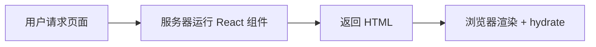
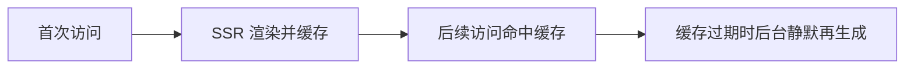
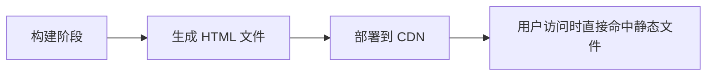
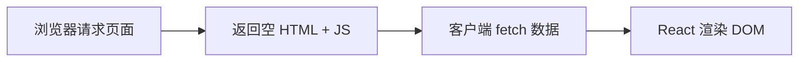

https://blog.csdn.net/jackson_mseven/category_12528926.html

https://mp.weixin.qq.com/s/x_oTytXbYLsj5bheUrulHQ

# 概述

[Next.js ↪](https://nextjscn.org/) 是一个基于 React 的全栈框架，用于快速构建高性能的服务器端渲染（SSR）和静态生成（SSG）网页应用。

本文主要记录 Next.js 的学习路程，便于日后回溯，非官方指南，中文指南请参考 [这里 ↪](https://nextjs.net.cn/)。

> 💡 提示：
>
> 1. VS Code 推荐安装插件：[Nextjs snippets ↪](https://marketplace.visualstudio.com/items?itemName=PulkitGangwar.nextjs-snippets) / [Tailwind CSS IntelliSense ↪](https://marketplace.visualstudio.com/items?itemName=bradlc.vscode-tailwindcss)。
> 2. 您可以直接从 [Next.js 快速指南 ↪](https://nextjs.org/learn/dashboard-app) 开始了解基础用法。
> 3. 图标库：[heroicons ↪](https://heroicons.com/)
> 4. 组件库：[tailwind ui ↪](https://tailwindui.com/components)

## SSR / ISR / SSG / CSR

这四个渲染模式是理解 Next.js、现代前端架构和性能优化 的核心概念。

### SSR

Server-Side Rendering（服务器端渲染）

**原理：**

- 每次用户访问页面时，服务器都会执行 React 代码，然后生成 HTML 返回浏览器。
- 浏览器接收后再进行水合（hydrate）→ 变成交互页面。



**特点：**

- 每次请求都是真实渲染 → 数据最新。
- 首屏快，SEO 友好，但服务器压力较大。

```tsx
export const dynamic = "force-dynamic"; // 强制 SSR

export default async function Page() {
  const res = await fetch("https://api.example.com/data", { cache: "no-store" });
  const data = await res.json();
  return <div>{data.title}</div>;
}
```

**适用场景：**需要实时数据的页面（如用户中心、订单详情、新闻实时榜单）。

### ISR

Incremental Static Regeneration（增量静态再生成）

**原理：**

- 首次访问时生成静态 HTML
- 缓存到 CDN
- 后续请求命中缓存
- 一段时间后缓存过期，下一次请求触发再生成



**特点：**

- 首屏性能接近静态
- 数据可定期更新
- 对服务器压力低

```tsx
export const revalidate = 60; // 每 60 秒再生成一次页面

export default async function Page() {
  const res = await fetch("https://api.example.com/posts");
  const posts = await res.json();
  return <PostList posts={posts} />;
}
```

**适用场景**：内容经常变但不需实时（如首页、产品列表、博客文章页）。

### SSG

Static Site Generation（静态生成）

**原理：**

- 在 **构建时** 就生成所有页面的 HTML
- 部署后直接走 CDN 静态文件



**特点：**访问极快，几乎无服务器负担，但内容固定（除非重新部署）。

```tsx
export const dynamic = "force-static"; // 强制 SSG

export async function generateStaticParams() {
  const posts = await fetch("https://api.example.com/posts").then((r) => r.json());
  return posts.map((p) => ({ slug: p.slug }));
}

export default function Post({ params }) {
  // 所有静态页面在构建时生成
}
```

**适用场景**：几乎不变化的页面（如博客、产品文档、Landing Page）

### CSR

Client-Side Rendering（客户端渲染）

**原理：**

- 首屏返回一个空的 HTML + JS；
- 浏览器加载 JS 后，自己 fetch 数据并渲染页面。



**特点：**完全在浏览器端渲染，不适合 SEO，但最灵活，适合复杂交互。

```tsx
"use client";
import { useEffect, useState } from "react";

export default function Dashboard() {
  const [data, setData] = useState(null);

  useEffect(() => {
    fetch("/api/user").then(res => res.json()).then(setData);
  }, []);

  return <div>{data ? data.name : "Loading..."}</div>;
}
```

**适用场景**：后台管理系统、可视化界面、登录后交互页面、控制台、表单页面等。

总结一句话：

1、**SSR**：实时渲染，适合频繁变动内容

2、**ISR**：准实时渲染，兼顾性能与动态

3、**SSG**：构建时生成，性能最强但静态

4、**CSR**：客户端渲染，适合登录后复杂交互

# 准备工作

开发相关环境：

- `Node`：`v25.1.0`
- `pnpm`：`v10.20.0`
- `Next.js v16+` / `App Router`

在使用 pnpm 安装依赖时，可配置镜像，在根目录创建 .npmrc 文件，指定镜像源：

```
registry=http://registry.npmmirror.com
```

# 创建项目

@See https://nextjs.org/docs/app/getting-started/installation

```shell
$ pnpm create next-app@latest nextjs-learns --use-pnpm [--yes]
✔ Would you like to use the recommended Next.js defaults? › No, customize settings
✔ Would you like to use TypeScript? … No / 【Yes】
✔ Which linter would you like to use? › Biome
✔ Would you like to use React Compiler? … No / 【Yes】
✔ Would you like to use Tailwind CSS? … No / 【Yes】
✔ Would you like your code inside a `src/` directory? … No / 【Yes】
✔ Would you like to use App Router? (recommended) … No / 【Yes】
✔ Would you like to use Turbopack? (recommended) … No / 【Yes】
✔ Would you like to customize the import alias (`@/*` by default)? … No / 【Yes】
✔ What import alias would you like configured? … @/*
```

> 提示：`--yes` 会跳过提示，使用已保存的偏好或默认设置。

进入项目目录并启动项目：

```shell
$ code nextjs-learns
$ pnpm dev
```

# 目录结构

@See https://nextjs.org/docs/app/getting-started/project-structure

> 温馨提示：**建议仔细阅读该章节以及 [文件系统约定 ↪](https://nextjs.org/docs/app/api-reference/file-conventions)**，熟悉 Next.js 中的文件夹和文件约定以及组织项目的提示。

基础约定文件

```
src/app
├── error.tsx        # 运行中错误
├── layout.tsx       # 布局，提供页面基础布局
├── loading.tsx      # 过渡页面
├── nout-found.tsx   # 404
└── page.tsx         # 页面
```

路由结构控制

| **特性** | **目录名**    | **用途**               |
| -------- | ------------- | ---------------------- |
| 路由分组 | `(group)`     | 不影响 URL，只组织结构 |
| 动态路由 | `[slug]`      | 单层动态变量           |
| 可变多层 | `[...slug]`   | 捕获所有多级路径       |
| 可选多层 | `[[...slug]]` | 匹配父路径及所有下级   |
| 并行路由 | `@name`       | 同时渲染多个 UI 分支   |
| 私有目录 | `_folder`     | 不会成为路由           |

## `(group)`

@See https://nextjs.org/docs/app/getting-started/project-structure#route-groups

组织页面文件，不影响最终 URL，只影响项目结构与分组

```
app/
├── (marketing)/
│   ├── about/page.tsx      # URL: /about
│   └── blog/page.tsx       # URL: /blog
└── (shop)/
    ├── products/page.tsx   # URL: /products
    └── cart/page.tsx       # URL: /cart
```

## `[slug]`

@See https://nextjs.org/docs/app/api-reference/file-conventions/dynamic-routes

动态路由，匹配单层动态参数

```
app/
└── blog/
    └── [slug]/
         └── page.tsx       # URL: /blog/123
```

##  `[...slug]`

@See https://nextjs.org/docs/app/api-reference/file-conventions/dynamic-routes#catch-all-segments

匹配 **多个层级** 的可变路径段

```
app/
└── shop/
    └── [...slug]/     # 匹配: /shop/a, /shop/a/b, /shop/a/b/c
        └── page.tsx 
 
```

##  `[[...slug]]`

@See https://nextjs.org/docs/app/api-reference/file-conventions/dynamic-routes#optional-catch-all-segments

匹配父路径自身 + 多级路径，可选存在。

```
app/
└── blog/
    └── [[...slug]]/   # 匹配: /blog, /blog/a, /blog/a/b
        └── page.tsx  
```

## `@folderName`

@See https://nextjs.org/docs/app/api-reference/file-conventions/parallel-routes

多个页面同时渲染于同一布局中（如 Dashboard 布局的统计 + 列表并行渲染）。

```
app/
├── @team/
│   └── page.tsx
├── @analytics/
│   └── page.tsx
└── layout.tsx     # 可以同时渲染 team 和 analytics
```

## `_folderName`

@See https://nextjs.org/docs/app/getting-started/project-structure#private-folders

标记为 **私有**，不会成为路由的一部分。

```
app/
├── _lib/                    # 不会成为路由
│   └── utils.ts
└── dashboard/
    └── page.tsx             # URL: /dashboard
```

# 路由

@See https://nextjs.org/docs/app/building-your-application/routing

> 温馨提示：本示例主要使用 `APP Router`。

## 定义路由

Next.js 使用 **基于文件系统的路由**，文件夹与文件决定页面的 URL 结构。

一个文件夹代表一个 URL 段，**嵌套文件夹 = 嵌套路由**。

page.tsx 文件使该路由段可访问。

值得注意的是：

1. 只有存在 page.tsx 的目录才会成为可访问路由

   ```
   app/blog/page.tsx → /blog
   ```

2. 页面默认是 Server Component，如需变成 Client Component，在文件顶部添加：

   ```
   'use client'
   ```

3. 页面可以在服务端或客户端获取数据

4. 页面始终是路由的“叶子节点”，即

   - page.tsx 不能包含子路由
   - 子路由必须在其旁边的文件夹中创建

   ```
   app/dashboard/page.tsx     # OK
   app/dashboard/users/page.tsx   # OK
   app/dashboard/page.tsx/users   # ❌ 不允许
   ```

## 布局和模板

@See https://nextjs.org/docs/app/getting-started/layouts-and-pages

@See https://nextjs.org/docs/app/api-reference/file-conventions/template

`layout.tsx` 和 `template.tsx` 允许您创建在路由之间共享的UI。

1. 布局：用于在多个路由之间共享 UI，例如导航栏、侧边栏、页脚等。布局在路由切换时保持挂载，因此不会重新渲染、不会丢失内部状态，并且可以层层嵌套。
2. 模板：与布局类似，也用于包装子页面或子布局，但在路由切换时会重新创建实例。模板不会保留组件状态，DOM 会重新挂载，适合需要强制刷新 UI 的场景。

布局 = 持久 UI（状态保留）

模板 = 每次导航重新创建（状态不保留）

## 链接和导航

@See https://nextjs.org/docs/app/getting-started/linking-and-navigating

Next.js 有四种在路由之间导航的方法：

1. 使用 [\<Link>](https://nextjs.org/docs/app/api-reference/components/link) 组件 —— 预取/局部刷新/控制跳转是否滚动顶部等
2. 使用 [useRouter()](https://nextjs.org/docs/app/api-reference/functions/use-router) 钩子函数 —— 客户端组件
3. 使用 [redirect](https://nextjs.org/docs/app/api-reference/functions/redirect) 函数 —— 服务端组件
4. 使用 [History API](https://nextjs.org/docs/app/getting-started/linking-and-navigating#native-history-api)

## 重定向

@See https://nextjs.org/docs/app/guides/redirecting

## 动态路由

@See https://nextjs.org/docs/app/api-reference/file-conventions/dynamic-routes

当你无法提前确定路由段名称，并希望根据动态数据生成路由时，可以使用 **动态路由段**。这些路由段可以在请求时动态填充，或者在构建时预渲染。这种方式非常适合用于用户详情页、文章详情页等路径会随数据变化的场景。

可以通过将文件夹名称括在方括号中来创建动态分段：[folderName]。例如，[id] 或 [slug]。

假设，现在需要创建一个博客列表和博客详情页面，你可以定义如下目录结构：

```
.
└── app
    └── blogs
        ├── [slug]
        │   └── page.tsx # 博客详情页 
        └── page.tsx     # 博客列表页
```

在上述结构中：

- [slug] 是动态路由段，可以根据不同的参数生成路径，比如 /1

- 文件夹名称中的slug 会作为参数传递给页面组件，供你访问和使用。

动态段作为 params 属性传递给布局、页面、路由和生成元数据函数：

```tsx
// blogs/[slug]/page.tsx
export default async function Page({
  params,
}: {
  params: Promise<{ slug: string }>;
}) {
  const { slug } = await params;
  return (
    <div className="p-8 text-center">
      <h1>This is blog details of slug：{slug}</h1>
    </div>
  );
}
```

> 温馨提示：在 Next.js 中，params 是一个 Promise 属性，因此无法直接使用它的值。
>

## 并行（平行）路由

@See https://nextjs.org/docs/app/api-reference/file-conventions/parallel-routes

Next.js 的 **平行路由（Parallel Routes）** 允许在同一页面上同时渲染多个路由节点，每个节点可以独立加载和更新，适合复杂嵌套布局和多视图页面的场景。


默认情况下，Next.js 会跟踪每个槽的活动状态，受导航类型（软导航/硬导航）影响。在平行路由页面及其子页面刷新时可能出现 404，此时可以通过定义 default.tsx 文件提供后备 UI。

## 拦截路由

@See https://nextjs.org/docs/app/api-reference/file-conventions/intercepting-routes

在 Next.js 中，**拦截路由**允许在导航时临时覆盖路由行为，而不是直接跳转页面。它可以将目标页面内容以模态窗口、侧边栏或嵌套视图的形式展示，同时保留当前页面的背景。

典型场景：在产品列表页点击某个产品时，通过拦截路由弹出产品详情模态框，而路由地址更新到对应详情页，方便分享和直接访问。用户关闭模态框后，路由恢复到原页面状态。这种设计既保持页面连续性，又支持 URL 的准确性和分享性。

先看示例：


在这个场景中，我们实际上会涉及 **3 个页面**：**列表页**、**模态框** 和 **详情页**。具体来说：

1. **列表页**：这是用户首先看到的主页面，展示了所有产品的列表。
2. **模态框**：通过路由拦截实现，它实际上可以被视为一个独立的页面，只不过是在列表页的基础上以浮层（模态框）的形式叠加展示。
3. **详情页**：这是目标页面，当用户直接通过分享的链接访问时，会展示完整的产品详情内容，替代列表页。

在实现过程中，当用户在列表页点击某个产品时，利用 **路由拦截** 将目标页面以模态框形式展示，而非完全跳转到详情页。此时，页面实际上同时呈现了 **列表页** 和 **模态框**（也就是拦截的路由页面）。

这种效果可以通过 **并行路由** 来实现。并行路由允许开发者定义多个路由区域，让页面能够在主区域渲染列表的同时，在另一个区域（如模态框）渲染详情内容，从而实现多视图协同显示。

接下来，我们创建目录：

```
.
└── app/
    ├── @modal/              # 并行路由
    │   ├── (.)products/     # 拦截路由
    │   │   └── [id]/
    │   │       └── page.tsx # 拦截路由页面
    │   └── default.tsx      # 默认路由
    ├── products/            # 页面
		│   ├── [id]
 	  │		│   └── page.tsx     # 产品详情页
    │   └── page.tsx         # 产品列表页
    ├── layout.tsx           # 根路由
    └── page.tsx             # 跟页面
```

> 提示：拦截路由前面的 `(.)` 表示在当前层级中匹配 `photos` 路由，如果是返回上一级可以这样表示 `(..)`，更多路由层级匹配表示法请参考 [这里 >>](https://nextjs.org/docs/app/api-reference/file-conventions/intercepting-routes#convention)

直接贴代码：

```tsx
// app/@modal/default.tsx
export default function Default() {
  return null;
}
```

```tsx
// app/@modal/(.)products/[id]/page.tsx
"use client";
import Image from "next/image";
import { useParams, useRouter } from "next/navigation";
import { useEffect, useState } from "react";

export default function ProductDetails() {
  const params = useParams<{ id: string }>();
  const router = useRouter();

  const [details, setDetails] = useState<any>();

  useEffect(() => {
    document.body.style.overflow = "hidden";
    return () => {
      document.body.style.overflow = "unset";
    };
  }, []);

  useEffect(() => {
    (async () => {
      const res = await fetch(`https://dummyjson.com/products/${params.id}`);
      setDetails(await res.json());
    })();
  }, [params]);

  if (!details) return null;

  return (
    <div
      className="flex justify-center items-center fixed inset-0 bg-gray-500/80 "
      onClick={router.back}
    >
      <div className="w-[300px] h-[300px] bg-white rounded-md">
        <Image
          src={details.thumbnail}
          width={300}
          height={300}
          loading="eager"
          alt={details.title}
          className="rounded-lg object-cover "
          onClick={(e) => e.stopPropagation()}
        />
      </div>
    </div>
  );
}

```

```tsx
// app/products/page.tsx
import Image from "next/image";
import Link from "next/link";

const fetchData = async () => {
  const res = await fetch("https://dummyjson.com/products");
  return res.json();
};

export default async function Page() {
  const data = await fetchData();
  return (
    <div className="bg-white">
      <div className="mx-auto max-w-2xl px-4 py-16 sm:px-6 sm:py-24 lg:max-w-7xl lg:px-8">
        <h2 className="sr-only">Products</h2>
        <div className="grid grid-cols-1 gap-x-6 gap-y-10 sm:grid-cols-2 lg:grid-cols-3 xl:grid-cols-4 xl:gap-x-8">
          {data.products.map((product: any) => (
            <Link
              key={product.id}
              href={`/products/${product.id}`}
              className="group"
            >
              <Image
                alt={product.title}
                src={product.thumbnail}
                className="aspect-square w-full rounded-lg bg-gray-200 object-cover group-hover:opacity-75 xl:aspect-7/8"
                width={400}
                height={800}
              />
              <h3 className="mt-4 text-sm text-gray-700">{product.title}</h3>
              <p className="mt-1 text-lg font-medium text-gray-500">
                {product.price}
              </p>
            </Link>
          ))}
        </div>
      </div>
    </div>
  );
}

```

```tsx
// app/products/[id]/page.tsx
import Image from "next/image";

const fetchDetails = async (id: string) => {
  const res = await fetch(`https://dummyjson.com/products/${id}`);
  return await res.json();
};
export default async function Page({
  params,
}: {
  params: Promise<{ id: string }>;
}) {
  const { id } = await params;
  const details = await fetchDetails(id);
  return (
    <div className="container mx-auto mt-8">
      <Image
        className=" rounded-lg block mx-auto"
        src={details.thumbnail}
        alt={details.title}
        width={300}
        height={300}
        loading="eager"
      />
      <div className="border-2 border-dashed border-gray-500 rounded-lg p-3 mt-6 leading-8">
        <p>
          <strong>Title：</strong>
          {details.title}
        </p>
        <p>
          <strong>Price：</strong>
          {details.price}
        </p>
        <p>
          <strong>Desc：</strong>
          {details.description}
        </p>
      </div>
    </div>
  );
}

```

```tsx
// app/layout.tsx
import "./globals.css";

export default function RootLayout({
  children,
  modal,
}: Readonly<{
  children: React.ReactNode;
  modal: React.ReactNode;
}>) {
  return (
    <html lang="en">
      <body>
        {children}
        {modal}
      </body>
    </html>
  );
}

```

## 路由处理程序

@See https://nextjs.org/docs/app/api-reference/file-conventions/route

> 提示：前后端分离的应用，几乎用不到。

## 路由参数

这里主要介绍在服务端组件和客户端组件中获取 `params` 和 `query` 参数的方式：

| #           | ☁️ 服务端组件             | 💻 客户端组件        |
| ----------- | ------------------------ | ------------------- |
| 获取Params  | `props.params` — Promise | `useParams()`       |
| 获取Queries | `props.searchParams`     | `useSearchParams()` |

# 服务端组件和客户端组件

@See https://nextjs.org/docs/app/getting-started/server-and-client-components

默认情况下，布局和页面都是服务器组件。它允许你在服务器端获取数据并渲染部分 UI，还可以选择缓存结果，并将其流式传输到客户端。当需要交互功能或浏览器 API 时，可以使用客户端组件。逐步添加功能。

相关示例请参考 [这里 ↪](https://nextjs.org/docs/app/getting-started/server-and-client-components#examples)

## 如何使用？

当您需要以下情况时，请使用 **客户端组件**：

- 管理状态以及事件处理，例如 onClick、onChange
- 生命周期逻辑，例如 useEffect
- 仅限浏览器使用的 API，例如 localStorage、window、navigator.geolocation
- 自定义 Hook 或可复用逻辑

当您需要以下情况时，请使用 **服务器组件**：

- 从数据库或 API 获取数据
- 使用 API 密钥、令牌或其他机密信息，而不暴露给客户端
- 减少发送到浏览器的 JavaScript 代码量
- 改进首次内容绘制（FCP）并将内容逐步流式传输给客户端

## 工作原理

### **1️⃣** 在服务器端

- Next.js 使用 React 的 API 来协调渲染，每个路由段（布局或页面）被拆分成独立的块进行处理。
- **服务器组件** 被渲染成一种特殊的数据格式：**React 服务器组件有效载荷（RSC Payload）**。
- **RSC Payload** 包含：
  - 服务器组件的渲染结果
  - 指定客户端组件渲染位置的占位符及对应 JS 文件引用
  - 从服务器组件传递给客户端组件的属性
- HTML 与 RSC Payload 结合，用于服务端预渲染页面。

### 2️⃣ 客户端（首次加载）

- 浏览器首先显示服务端渲染的 HTML，实现快速首屏渲染。
- RSC Payload 用于协调客户端与服务器组件树，确保状态与数据同步。
- 客户端组件的 JS 被注入，使页面可交互。

### 3️⃣ 水合作用

- **Hydration** 是 React 将静态 HTML 附加事件处理器的过程，使页面变为可交互。
- 浏览器在加载 HTML 后，客户端 JS 会将事件绑定到对应元素上。

### 4️⃣ 后续导航

- RSC Payload 被预先获取并缓存，用于即时导航。
- 客户端组件在后续导航中完全在客户端渲染，无需再次请求服务端 HTML。

## 如何启用？

页面默认是服务端渲染，如果要启用客户端组件，在文件顶部通过 `use client` 声明。

## 最佳实践

在实际开发中，Next.js 页面通常作为服务端组件进行渲染，以保证快速首屏加载和减小客户端 JS 包体积。可将需要交互或状态管理的细粒度组件拆分为客户端组件，通过 props 将数据从服务器组件传递给客户端组件，实现高效渲染。客户端组件与服务端组件可以交错使用，对于共享状态，可通过客户端 Provider 管理：全局状态放置在 RootLayout 中，页面级状态放置在对应 page.tsx 中，从而在保持服务端渲染性能的同时，提供客户端交互能力和精细化状态管理。

# 缓存组件

@See https://nextjs.org/docs/app/getting-started/cache-components

Next.js 16 新增的 **组件缓存（Cache Components）** 让你可以缓存组件树中的某段服务器端逻辑，从而提升性能、减少重复请求，并让按需更新（revalidation）更简单。

在前后端分离的场景下，我们前端主要向远程 API 请求数据。Next.js 的 **Cache Components** 是一套把缓存控制从“页面级别”下沉到“组件/函数级别”的工具，能让你按需缓存那些**不常变或可容忍短期过期**的数据，同时保持其它部分动态。

先说结论：

- 默认（启用 Cache Components 后）页面是**动态为主**，你显式决定哪些组件/函数要缓存；
- 使用 use cache 为组件或异步函数建立缓存边界，配合 cacheLife 定义失效时间；

- 给请求或缓存打**标签（tag）**，方便之后按需刷新（revalidateTag / updateTag）；
- 不想缓存时继续用 fetch(..., { cache: 'no-store' })。

下面按几个主题讲清楚为什么用、怎么用、注意点。

## 为什么用？

当某些 API 返回的数据不是瞬时变化的（例如公共列表、配置、静态内容），把这些调用缓存起来能显著降低网络请求并提升首屏速度，同时你还能通过标签或路径手动/按需刷新缓存。

## 怎么用？

### `use cache` **+** `cacheLife`

**组件/函数级缓存**

把耗时或稳定的工作包成一个缓存边界：

```ts
// app/lib/getPosts.ts
import { cacheLife } from 'next/cache'

export async function getPosts() {
  'use cache'
  cacheLife('hours')   // 或 cacheLife(3600) 等
  return await fetch('https://api.example.com/posts').then(r => r.json())
}
```

把 'use cache' 放在组件或函数顶端后，Next.js 会把这个作用域内的数据/计算缓存起来并按 cacheLife 失效。

### `fetch(..., { next: { tags: [...] } })`

**给请求打标签**

在 fetch 时打标签，方便后续按标签刷新：

```ts
await fetch('/api/posts', { next: { tags: ['posts'] } })
```

### `revalidateTag('name', 'max')`

**按标签重新验证**

在某个后端操作或 Server Action 中触发按需刷新（stale-while-revalidate）：

```ts
import { revalidateTag } from 'next/cache'
await revalidateTag('posts', 'max')
```

'max' 表示使用 stale-while-revalidate：先继续提供旧数据，后台去拉新数据再更新缓存。

### `updateTag('name')`

**立即失效，用于写操作后**

写操作（用户创建/修改）后，如果希望读取马上看到最新数据，在 Server Action 里调用：

```ts
import { updateTag } from 'next/cache'
await updateTag('posts')   // 立即使 posts 标签缓存失效
```

updateTag 主要用于**写后立即失效**场景，适合需要读写一致性的 UX。

### `revalidatePath('/some/path')`

**按路径刷新**

如果你只想让某个页面/路由重新验证数据：

```ts
import { revalidatePath } from 'next/cache'
await revalidatePath('/dashboard')
```

## 注意事项

- **必须启用** cacheComponents: true（next.config）才能使用 Cache Components 功能。
- use cache 的参数 **必须可序列化**（普通对象/数组/原始值），不能传复杂类实例或函数（除非不去 introspect）。
- 如果组件依赖请求级运行时数据（如 cookies()、headers()、searchParams），就不能在静态预渲染阶段使用，需要把该部分放进 \<Suspense> 边界或保持动态。
- use cache 与 fetch 的 next: { tags }/revalidate 配合使用，能覆盖大多数前端分离场景的缓存需求。
- updateTag 需要在 **Server Action**（或服务端环境）里调用；前端发起写请求后，后端应负责触发它或返回机制让前端触发相应路由刷新。

## 实战建议

- 公共列表（产品列表、分类等）：使用 use cache + cacheLife('hours') 或 fetch(..., { next: { tags: ['posts'] } }) + 周期 revalidate。
- 用户相关或高度实时的数据：用 cache: 'no-store'（每次请求最新）。
- 用户提交内容后想马上看见：在后端（或 Server Action）调用 updateTag('posts') 或 revalidatePath('/posts')。
- 需要兼顾快速首屏和后台刷新：给静态 shell 用 use cache，把会变的部分用 tags + revalidateTag('max') 做 stale-while-revalidate。

# 数据获取

@See https://nextjs.org/docs/app/getting-started/fetching-data

在 Next.js 中，数据获取主要分为 **服务端组件** 和 **客户端组件** 两类，适用于前后端分离的场景。

## 在服务端组件获取数据

服务端组件可以直接使用 fetch 或数据库查询获取数据，渲染后将 HTML 发送给客户端。

- 默认情况下，**fetch 不缓存响应**，每次访问页面都会重新请求最新数据。
- 如果页面没有使用动态 API（如 cookies()、headers() 或 searchParams），Next.js 会在构建阶段进行**预渲染（Prerendering）**，生成静态页面。
- 静态页面可以通过 **ISR（Incremental Static Regeneration）** 增量更新。

示例：

```tsx
export default async function Page() {
  const data = await fetch("https://jsonplaceholder.typicode.com/posts");
  const posts = await data.json();
  return (
    <ul>
      {posts.map((post: any) => (
        <li key={post.id}>{posttitle}</li>
      ))}
    </ul>
  );
}
```

**动态渲染**

如果需要基于请求的实时数据生成页面，可显式设置：

```ts
export const dynamic = 'force-dynamic';
```

> 总结：
>
> - 无动态依赖：页面可静态生成，支持 ISR。
>- 需动态数据：使用 dynamic = 'force-dynamic' 或依赖动态 API 自动切换到动态渲染。

## 在客户端组件获取数据

客户端组件通常在渲染后通过副作用或数据请求库获取数据：

1️⃣ **useEffect** **+ fetch/axios**

- 在组件挂载或依赖变化时发起请求。
- 简单直接，适合少量数据或非关键渲染。

2️⃣ **TanStack Query / SWR 等库**

- 提供缓存、轮询、请求去重等高级功能。
- 减少手动状态管理，适合复杂或频繁请求的场景。

> 建议：优先在服务端组件获取数据，减小客户端 JS 包体积和首次加载时间；客户端获取适合依赖用户交互、实时更新或个性化请求。

## 添加搜索和分页

使用 URL 参数实现搜索和分页有以下优势：

- **可书签和共享 URL**：用户可保存或分享当前状态。
- **服务端渲染**：URL 参数可直接用于服务端渲染初始状态。
- **数据分析**：便于统计和追踪用户行为。

相关 Next.js 钩子：

- **客户端组件**：`useSearchParams()` 获取 URL 查询参数，`usePathname()` 获取路径，`useRouter()` 进行导航。
- **服务端组件**：可通过 `props.searchParams` 获取搜索参数。

# 更新数据

@See https://nextjs.org/docs/app/getting-started/updating-data

Next.js 提供了 **Server Actions** 来在服务端直接更新数据，但在 **前后端分离** 的项目中几乎不用，因为前端通常通过独立 API 与后端交互。

> 温馨提示：了解 Server Actions 的概念即可，无需深入使用。

# 缓存和重新验证

@See https://nextjs.org/docs/app/getting-started/caching-and-revalidating

@See https://nextjs.org/docs/app/guides/caching#request-memoization

相关概念：

- 缓存（cache）：存储数据请求或计算结果，下次请求相同内容时避免重复请求。
- 重新验证（revalidate）：当数据变化时，可以通过 API 手段使缓存失效，并重新拉取最新数据，而不需要重建整个站点。

在前后端分离的架构下，我们常用 Next.js 向远程 API 发起 fetch 请求获取数据。这时候，合理使用缓存和重新验证机制，既能减少请求次数，又能保证数据新鲜度。

默认情况下，Next.js 的 fetch 请求**不会自动缓存**。也就是说，如果你什么都不设置，每次访问都会重新请求最新数据。但你可以显式开启缓存：

```tsx
await fetch('/api/data', { cache: 'force-cache' })
```

这样会把请求结果缓存起来，下次相同请求就可以复用。

## 周期刷新

假如你请求的是后台公开接口（比如产品列表或公共资讯），数据不会秒变，但也要定期刷新。这种情况可以使用 next.revalidate：

```tsx
await fetch('/api/data', { next: { revalidate: 3600 } })
```

设置为 3600 秒后，Next.js 会返回旧数据给用户，但后台会启动一次重新请求（stale‑while‑revalidate），等拿到后更新缓存。这样既快，又能保持数据不过时。

## revalidateTag

对于某些数据，你想在特定事件发生后（比如用户提交了表单、内容更新）再刷新缓存。这时可以用 **标签机制**：

1. 请求时给数据打标签：

   ```tsx
   await fetch('/api/user', { next: { tags: ['user'] } })
   ```

2. 在服务端逻辑里（Server Action 或 Route Handler）触发刷新：

   ```ts
   import { revalidateTag } from 'next/cache'
   await revalidateTag('user', 'max')
   ```

使用 `profile="max"` 的配置时，Next.js 会继续返回旧数据，同时后台去请求新数据。这就是经典的 stale‑while‑revalidate 模型，非常适合 “写完就刷新，但不打断体验” 的场景。

## updateTag

如果你的前端是客户端发起写操作（如创建文章、更新用户信息等），希望用户马上看到最新内容，可以用 updateTag：

```ts
import { updateTag } from 'next/cache'

export async function savePost(data) {
  await apiCreatePost(data)
  updateTag('posts')
}
```

updateTag 只能在 Server Action 中调用，一旦触发，它会立即使对应标签的缓存失效。下一个读取这个标签数据的请求将不会读旧数据。

## revalidatePath

有时你只想刷新某一个页面或某个路由，而不是所有同标签的数据。这时候 revalidatePath 就非常简单直接：

```tsx
import { revalidatePath } from 'next/cache'
await revalidatePath('/dashboard')
```

这个调用会重新验证 /dashboard 这个路径的数据，非常适合做页面级别的手动刷新。

## 总结

| 缓存模式            | 配置方式                   | 适用场景                               | 数据更新方式   |
| ------------------- | -------------------------- | -------------------------------------- | -------------- |
| 静态缓存            | `cache: 'force-cache'`     | 不常变化的数据                         | 构建时固定     |
| 动态缓存            | `cache: 'no-store'`        | 实时更新的数据                         | 每次请求都刷新 |
| 增量静态再生成(ISR) | `next: { revalidate: 60 }` | 需要定期更新但可延迟的数据定期重新验证 | 定期重新验证   |

- 对于公共、不频繁变化的数据（比如公共列表、公共 API）：使用 force-cache + revalidate，定期后台刷新。
- 对于用户数据或实时内容：可以选择 no-store，每次都请求最新数据。
- 对于写操作后想立刻看到更新的数据：在写操作里调用 updateTag。
- 对于想手动刷新页面数据：在服务端逻辑中使用 revalidatePath。

# 代理

@See https://nextjs.org/docs/app/api-reference/file-conventions/proxy

proxy.ts 文件用于在请求完成前，在服务端执行自定义逻辑。根据请求内容，你可以：

- 修改响应（rewrite）
- 重定向（redirect）
- 修改请求或响应头
- 直接返回自定义响应

**特点和注意事项**：

1. 执行时机
   - 在路由渲染之前执行，适合做服务器端逻辑，比如认证、日志记录、重定向处理等。
2. 独立于渲染代码
   - Proxy 与页面渲染逻辑分开，不依赖共享模块或全局状态。
   - 在优化情况下，可以部署到 CDN 以快速处理 rewrite 或 redirect。
3. 信息传递
   - 如果需要把信息传递给应用，可以使用 headers、cookies、rewrite、redirect 或 URL 参数。
4. 文件位置
   - 放在项目根目录或 src 下，与 pages 或 app 同级。
   - 如果自定义了 pageExtensions（如 .page.ts），则命名为 proxy.page.ts。

简单理解：proxy.ts 就是一个**服务端请求拦截器**，在页面渲染前处理请求，适合做认证、重定向和响应修改，和前端渲染逻辑完全分离。

# 加载UI和流式传输

@See https://nextjs.org/docs/app/api-reference/file-conventions/loading

通过 loading.tsx 可以使用 React Suspense 创建有意义的加载UI（比如 骨架图），基于此，可以在加载路由内容时显示服务器的即时加载状态，渲染完成后，将自动切入新内容。


现在，我们模拟渲染一个列表：

```tsx
// app/page.tsx
import React from "react";
import mockjs from "mockjs";
import Image from "next/image";

async function fetchData() {
  // -- 模拟耗时
  await new Promise((resolve) => setTimeout(resolve, 3 * 1000));
  // -- 模拟数据
  return mockjs.mock({
    code: 200,
    message: "success",
    "data|5": [
      {
        "id|+1": 1,
        title: "@title",
        cover: "@Image('80x80','@color')",
        description: "@paragraph",
      },
    ],
  });
}

export default async function Page() {
  const res = await fetchData();
  return (
    <div className="container mx-auto p-8 space-y-4">
      {res.data.map((item: any) => (
        <div className="flex" key={item.id}>
          <div className="w-20 h-20 shrink-0 relative mr-4">
            <Image className="object-cover rounded-md" src={item.cover} fill alt="cover" sizes="80px" />
          </div>
          <div className="flex-1">
            <div className="text-gray-900 truncate">{item.title}</div>
            <div className="line-clamp-2 text-sm text-gray-400">{item.description}</div>
          </div>
        </div>
      ))}
    </div>
  );
}
```

代码片段中，模拟请求耗时 3s，当导航到当前路由时，页面将会出现 3s 的空白，然后再渲染如下内容：


严格上来说，这样的交互是不太友好的，此时我们应该使用流式传输来实现备用 ui，首先我们创建文件：`/app/ui/Skeletons.tsx`，文件代码如下：

```tsx
const shimmer =
  "before:absolute before:inset-0 before:-translate-x-full before:animate-[shimmer_2s_infinite] before:bg-gradient-to-r before:from-transparent before:via-white/60 before:to-transparent";

export function HeroSkeleton() {
  return (
    <div className={`${shimmer} relative container mx-auto p-8 space-y-4`}>
      {Array.from({ length: 5 })
        .fill(0)
        .map((_, index) => (
          <div className="flex" key={index}>
            <div className="w-20 h-20 shrink-0 relative mr-4 bg-gray-200 rounded-md"></div>
            <div className="flex-1">
              <div className="h-6 bg-gray-200 rounded-md mb-2"></div>
              <div className="space-y-1">
                <div className="w-full h-4 bg-gray-200 rounded-md"></div>
                <div className="w-1/2 h-4 bg-gray-200 rounded-md"></div>
              </div>
            </div>
          </div>
        ))}
    </div>
  );
}
```

> 提示：
>
> 1. 为了使 tailwindscss 样式生效，我们需在 `tailwind.config.ts`  配置文件中将 `ui` 目录加入配置项。
>
>    ```tsx
>    {
>      "content": [
>        ...
>        "./src/ui/**/*.{js,ts,jsx,tsx,mdx}"
>        ...
>    	]
>    }
>    ```
>
> 2. 代码片段中定义了 `shimmer` 动画，此时我们还需要在 `tailwind.config.ts` 文件中添加一个帧动画配置
>
>    ```tsx
>    import type { Config } from "tailwindcss";
>    export default {
>      ...
>      theme: {
>        // -- 定义动画
>        keyframes: { shimmer: { '100%': { transform: 'translateX(100%)' } } },
>      },
>    } satisfies Config;
>    ```
>
> 3. ...

接下来，我们在 `page.tsx` 同级目录里中，创建 `loading.tsx`，并填入如下代码：

```tsx
import { HeroSkeleton } from "@/ui/Skeletons";
import React from "react";

export default function Loading() {
  return <HeroSkeleton />;
}
```

渲染效果如下：


流式传输允许你将页面的 HTML 分解为更小的块，并逐步将这些块从服务器发送到客户端。


这使得页面的某些部分能够更快地显示，而无需等待所有数据加载后才能呈现任何 UI。

现在，我们将刚刚页面（`app/page.tsx`）中的代码提取到 `ui/HeroList.tsx` 中，然后修改页面代码如下：

```tsx
import React from "react";
import HeroList from "@/ui/HeroList";

export default async function Page() {
  return <HeroList />;
}
```

再次刷新页面，可以看到相同的效果，这种方式可以使得我们更细腻话的去控制组件的加载。

# 错误处理

@See https://nextjs.org/docs/app/getting-started/error-handling

错误可以分为两类：预期的错误和未捕获的异常：

1. **预期的错误通过返回值处理**：对于服务器端的操作（Server Actions），避免使用 try/catch 来处理预期会发生的错误，而是通过 useActionState 来管理这些错误，并将错误信息返回给客户端。
2. **未预期的异常用错误边界处理**：对于未预期的异常，使用错误边界（Error Boundaries）来处理。可以通过 error.tsx 和 global-error.tsx 文件来实现错误边界，并提供备用的界面显示（Fallback UI）。

### 处理预期错误

预期的错误是指在应用程序正常运行中可能发生的错误，例如服务器端表单验证失败或请求失败。这类错误应该被明确处理，并返回给客户端。

#### 处理服务端操作中的预期错误

使用 useActionState 钩子管理服务器端操作（Server Actions）的状态，包括错误处理。通过这种方式，可以避免使用 try/catch 块来处理预期的错误。这些错误应被设计为返回值，而不是抛出异常。


特别是在表单操作当中，假设输入账号或密码错误，应该给出相应的提示信息，而不是直接抛出异常，触发错误边界，如下所示：

```tsx
"use server";

import { revalidatePath } from "next/cache";
import { redirect } from "next/navigation";


export type State = {
  usernameErrorMsg?: string;
  passwordErrorMsg?: string;
}

export async function login(prevState: State, formData: FormData) {

  const username = formData.get('username')?.toString() || '';
  const password = formData.get('password')?.toString() || '';

  if (!/^1[3-9]\d{9}$/.test(username)) return { usernameErrorMsg: '手机号格式错误' }
  if (username !== '15888888888') return { usernameErrorMsg: '手机号不存在' }
  if (password !== '1234') return { passwordErrorMsg: '密码错误' }
  await new Promise((resolve) => setTimeout(resolve, 3000));

  revalidatePath('/dashboard');
  redirect('/dashboard');

}
```

接下来，我们可以将操作传递给 `useActionState` 钩子并使用返回的状态来显示错误消息。

```tsx
"use client";

import React, { useActionState } from "react";
import { login, State } from "@/actions";

export default function Login() {
  const initialState: State = { usernameErrorMsg: "", passwordErrorMsg: "" };
  const [state, formAction, isPending] = useActionState(login, initialState);
  return (
    <div className="h-lvh w-lvw flex justify-center items-center">
      <div className="px-10 py-6 bg-gray-100 rounded-md">
        <h1 className="text-blue-500 mb-4 text-2xl">登录</h1>
        <form action={formAction} className="space-y-4">
          {/* 账号 */}
          <div>
            <div>
              <label htmlFor="username">账号：</label>
              <input 
                type="tel" 
                id="username" 
                name="username" 
                placeholder="登录账号（手机号）" 
                className="p-1" 
                required 
                maxLength={11} 
              />
            </div>
            <p className="text-red-500 mt-1" aria-live="polite">
              {state?.usernameErrorMsg}
            </p>
          </div>
          {/* 密码 */}
          <div>
            <div>
              <label htmlFor="password">密码：</label>
              <input 
                type="password" 
                id="password" 
                name="password" 
                placeholder="登录密码" 
                className="p-1" 
                required 
                maxLength={20} 
              />
            </div>
            <p className="text-red-500" aria-live="polite">
              {state?.passwordErrorMsg}
            </p>
          </div>
          {/* 登录按钮 */}
          <button type="submit" className="w-full h-10 bg-blue-500 text-white rounded-md mt-20">
            {isPending ? "登录中..." : "登录"}
          </button>
        </form>
      </div>
    </div>
  );
}
```


> 温馨提示：你也可以使用返回的状态在客户端显示 toast 提示。

#### 处理服务器组件的预期错误

在服务器组件内部获取数据时，可以根据响应有条件地呈现错误消息或重定向。

```tsx
export default async function Page() {
  const res = await fetch('https://...');
  const data = await res.json();
  if (!res.ok) {
    return "There was an error.";
  }

  return "...";
}

```

### 未捕获的异常

未捕获的异常属于意外错误，表示在应用程序正常流程中不应发生的错误或问题。这些应该通过抛出错误来处理，然后错误边界会捕获错误。

1. 常见处理方式：使用 error.tsx 处理根布局下未捕获的错误（错误边界）。
2. 可选处理方式：使用嵌套的 error.tsx 文件（例如 app/dashboard/error.tsx）处理细粒度的未捕获错误。
3. 不常见的处理方式：<del>使用 global-error.js 处理根布局中未捕获的错误（全局错误）。</del>

#### 错误边界

@Seehttps://nextjs.org/docs/app/getting-started/error-handling#using-error-boundaries

Next.js 使用错误边界来处理未捕获的异常。错误边界捕获子组件中的错误并显示后备 UI，而不是崩溃的组件树。

# 样式

@See https://nextjs.org/docs/app/building-your-application/styling

推荐使用 [tailwindscss](https://tailwindcss.com/) + [clsx](https://www.npmjs.com/package/clsx) 

1. Tailwind 是一个 CSS 框架，允许您直接在 TSX 标记中快速编写实用程序类 ，从而加快开发过程。
2. clsx 是一个可让您轻松切换类名称的库。

在 Tailwind 配置文件中，添加将使用 Tailwind 类名的文件的路径，参考 [这里 >> ](https://nextjs.org/docs/app/building-your-application/styling/tailwind-css#configuring-tailwind)

# 优化

## 固定宽高比

```tsx
<div className="aspect-[16/9] bg-gray-200"></div>
```

上面的写法等价于：

```tsx
<div className="bg-gray-200" style={{aspectRatio: '16/9'}}></div>
```

实际开发中，你可以根据设计稿尺寸来设置，比如默认尺寸是：`1920x560`，可以这样设置：

```tsx
<div className="aspect-[1920/560] bg-gary-200"></div>
```

图片填充

```tsx
<div className="aspect-[1920/560] relative">
  <Image fill src={"/images/xxx.png"} alt="banner_Image" />
</div>
```

> 温馨提示：需要在容器上添加 `relative` 图片才能正常显示。

值得注意的是，设置宽高比并不是在设置元素尺寸，你还应该设置容器的宽度（或者高度），建设宽高比是 200/100（或者 2/1），容器宽度为 20%，则可以这样设置：

```tsx
<div className="aspect-[200/100] bg-gray-200 w-[20%] mx-auto"></div>
```

在实际应用中，比如图文混排，左侧图片右侧文字这种，通常容器设置为 flex 布局，此时如果文本高度高于图片高度，那么你设置的宽高比将不会生效，因为图片会被默认拉伸成同文本高度一致，如下所示：

```tsx
<div className="container mx-auto flex">
  <div className="aspect-[200/100] bg-gray-200 shrink-0 mr-8 rounded-md w-[30%]"></div>
  <div className="flex-1">
    <p>新华社北京12月9日电 中共中央政治局12月9日召开会议，分析研究2025年经济工作；听取中央纪委国家监委工作汇报，研究部署2025年党风廉政建设和反腐败工作。中共中央总书记习近平主持会议。</p>
    <p>
      会议强调，做好明年经济工作，要以习近平新时代中国特色社会主义思想为指导，全面贯彻落实党的二十大和二十届二中、三中全会精神，坚持稳中求进工作总基调，完整准确全面贯彻新发展理念，加快构建新发展格局，扎实推动高质量发展，进一步全面深化改革，扩大高水平对外开放，建设现代化产业体系，更好统筹发展和安全，实施更加积极有为的宏观政策，扩大国内需求，推动科技创新和产业创新融合发展，稳住楼市股市，防范化解重点领域风险和外部冲击，稳定预期、激发活力，推动经济持续回升向好，不断提高人民生活水平，保持社会和谐稳定，高质量完成“十四五”规划目标任务，为实现“十五五”良好开局打牢基础。
    </p>
  </div>
</div>
```

渲染结果：


此时你可以再套一层容器，如下所示：

```tsx
<div className="container mx-auto flex">
  <div className="w-[30%]">
    <div className="aspect-[200/100] bg-gray-200 shrink-0 mr-8 rounded-md"></div>
  </div>
  <div className="flex-1">
    <p>新华社北京12月9日电 中共中央政治局12月9日召开会议，分析研究2025年经济工作；听取中央纪委国家监委工作汇报，研究部署2025年党风廉政建设和反腐败工作。中共中央总书记习近平主持会议。</p>
    <p>
      会议强调，做好明年经济工作，要以习近平新时代中国特色社会主义思想为指导，全面贯彻落实党的二十大和二十届二中、三中全会精神，坚持稳中求进工作总基调，完整准确全面贯彻新发展理念，加快构建新发展格局，扎实推动高质量发展，进一步全面深化改革，扩大高水平对外开放，建设现代化产业体系，更好统筹发展和安全，实施更加积极有为的宏观政策，扩大国内需求，推动科技创新和产业创新融合发展，稳住楼市股市，防范化解重点领域风险和外部冲击，稳定预期、激发活力，推动经济持续回升向好，不断提高人民生活水平，保持社会和谐稳定，高质量完成“十四五”规划目标任务，为实现“十五五”良好开局打牢基础。
    </p>
  </div>
</div>
```

渲染结果：


## 图片

@See https://nextjs.org/docs/app/building-your-application/optimizing/image

@See https://nextjs.org/docs/app/api-reference/components/image

## 字体

@See https://nextjs.org/docs/app/building-your-application/optimizing/fonts

## 元数据

@See https://nextjs.org/docs/app/building-your-application/optimizing/metadata

## 静态资源

@See https://nextjs.org/docs/app/building-your-application/optimizing/static-assets

# 配置

## 环境变量

@See https://nextjs.org/docs/app/building-your-application/configuring/environment-variables

Next.js 内置了对环境变量的支持，因为 Next.js 是一个全栈框架，所以就区分了服务端环境变量和客户端环境变量；使用环境变量有两种方式：

1. 通过 `.env` 问见加载环境变量
2. 通过使用 `NEXT_PUBLIC_` 前缀来捆绑浏览器的环境变量

### .env 文件中加载环境变量

Next.js 内置支持从 `.env` 文件加载环境变量到 `process.env` 中的这个过程。我们在项目根目录下建立一个 `.env` 文件（注意是根目录，不是 `/src` 目录）

```ini
DB_HOST=localhost
DB_USER=admin
DB_PASS=123456
```

现在就可以在服务端组件或者路由处理程序中通过 `process.env` 获取到该值：

**路由处理程序**

```ts
import { NextResponse } from "next/server";

export async function GET() {
  const dbConfig = {
    host: process.env.DB_HOST,
    username: process.env.DB_USER,
    password: process.env.DB_PASS,
  }
  console.log('DB_CONFIG >>> ', dbConfig);
  return NextResponse.json({ status: 'ok' });
}
```

在浏览器中请求 `http://localhost:3000/api` 后，页面展示内容如下：

```
{
    "status": "ok"
}
```

请求后就能看到终端打印的环境变量的结果：

```shell
 ✓ Compiled /api in 83ms (318 modules)
DB_CONFIG >>>  { host: 'localhost', username: 'admin', password: '123456' }
```

**服务端组件**

这里就直接在 `/app` 目录下的 `page.tsx` 中来演示，代码如下

```tsx
console.log("process.env.DB_HOST", process.env.DB_HOST);
console.log("process.env.DB_USER", process.env.DB_USER);
console.log("process.env.DB_PASS", process.env.DB_PASS);
```

在浏览器访问 `http://localhost:3000/` 后，终端打印效果如下：

```shell
process.env.DB_HOST localhost
process.env.DB_USER admin
process.env.DB_PASS 123456
```

> 提示：如果 `.env` 文件不足以满足你的要求，Next.js 为了兼容其各场景的灵活性，提供了 @next/env 包来扩展！

### 浏览器中获取环境变量

Next.js 是一个全栈框架，自然也考虑到了浏览器环境的时候如何获取环境变量，也没有过多的文件配置，就是使用 `NEXT_PUBLIC_` 为前缀的环境变量就是浏览器环境中可以使用的。

> 为什么要加前缀呢？
>
> 因为 Next.js 为了让浏览器可以获取环境变量中的值，在构建的时候，将值内联到客户端的 js bundle 中，替换掉所有硬编码使用 `process.env.[variable]` 的地方。

实操一下：在 `.env` 文件中添加 `NEXT_PUBLIC_PLATFORM=PC` 然后在客户端组件中使用，客户端代码如下：

*`src/ui/Client.tsx`*

```tsx
"use client";
export default function Client() {
  console.log("NEXT_PUBLIC_PLATFORM：", process.env.NEXT_PUBLIC_PLATFORM);
  return <div>This is Client Component</div>;
}
```

接下来，请按如下步骤操作：

1. 在 `/app/page.tsx` 中引入 `<Client />` 组件
2. 接着在终端运行 `pnpm build` 构建项目
3. 构建完成之后使用命令 `pnpm start` 启动构建后的产物

启动之后，在终端查看访问链接，复制粘贴到浏览器中，看看是否打印了我们想要的环境变量：

```shell
NEXT_PUBLIC_PLATFORM： PC
```

可见，是打印了的，但是要注意！**动态查找的值是不会被内联**，比如：

```tsx
// 使用了变量，不会被内联，不会生效
const key = "NEXT_PUBLIC_PLATFORM";
const val = process.env[key];

// 使用了变量，不会被内联，不会生效
const env = process.env;
const val = env.NEXT_PUBLIC_PLATFORM;
```

### 默认环境变量

在开发过程中，通常一个 `.env` 文件就够用了。但有时候你可能还需要针对不同的环境去加载不同的配置，比如：开发环境（`.env.development`）、生产环境（`.env.production`）、所有环境（`.env`）。

如果均未在 `.env` 相关文件中配置环境变量，当执行 `next dev` 的时候，Next.js 会自动给 `NODE_DEV` 赋值 `development`，其他命令则会赋值 `production`。

> 提示：需要注意的是 NODE_ENV 的值：只允许值为 `production`、`development` 和 `test`。

在项目开发过程中一定要谨慎 `.env` 的相关文件，尽可能将 `.env` 相关文件添加到 `.gitignore` 文件中，因为这些都是机密信息。

### 测试环境的环境变量

有了开发环境和生产环境外，Next.js还第三个选项——**测试环境**；测试环境用于在使用测试工具如 Jest 或 Cypress 时，设置特定的环境变量。要配置测试环境，只需创建一个名为 `.env.test` 的文件，该文件中的值将在测试环境中使用。

需要注意的是，测试环境不会加载 `.env.local` 中的值。这是为了确保每个人都能产生相同的测试结果。这些默认值将在 `NODE_ENV` 设置为 `test` 时使用。

### 环境变量加载顺序

按顺序在以下位置查找环境变量，一旦找到变量就停止。

- `process.env`
- `.env.$(NODE_ENV).local`
- `.env.local`（当 `NODE_ENV` 是 `test` 的时候不会查找）
- `.env.$(NODE_ENV)`
- `.env`

举个例子来辅助理解，如果你在 `.env.development.local` 和 `.env` 中设置了 `NODE_ENV` 为 `development`，按照这个顺序，最终会使用 `.env.development.local` 中的值。

## 端口

@See https://nextjs.org/docs/app/api-reference/cli/next

指定端口和hostname

```shell
next dev --port=6969 --hostname=172.20.51.212
```

# 扩展

## 生成密钥

```shell
openssl rand -base64 32
```

## 使用Swiper轮播组件

@See https://www.swiperjs.net/

> 提示：在 nextjs 中使用 Swiper，唯一需要注意的就是一定要添加 `use client`  作为客户端组件使用。


