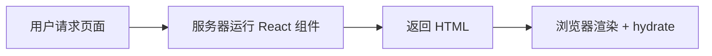
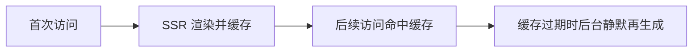
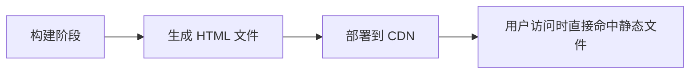
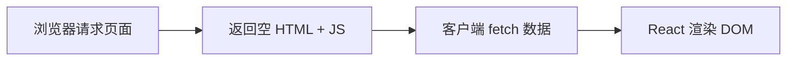

# 概述

[Next.js ↪](https://nextjs.org/) 是一个基于 React 的全栈框架，用于快速构建高性能的服务器端渲染（SSR）和静态生成（SSG）网页应用。

本文主要记录 Next.js 的学习路程，便于日后回溯，非 [官方指南 ↪](https://nextjs.org/)。

相关环境：

- Node.js：v24.8.0
- pnpm：v10.17.1
- Next.js：v16
- 路由模式：App Router

## SSR / ISR / SSG / CSR

这四个渲染模式是理解 Next.js、现代前端架构和性能优化 的核心概念。

### SSR

Server-Side Rendering（服务器端渲染）

**原理：**

- 每次用户访问页面时，服务器都会执行 React 代码，然后生成 HTML 返回浏览器。
- 浏览器接收后再进行水合（hydrate）→ 变成交互页面。



**特点：**

- 每次请求都是真实渲染 → 数据最新。
- 首屏快，SEO 友好，但服务器压力较大。

```tsx
export const dynamic = "force-dynamic"; // 强制 SSR

export default async function Page() {
  const res = await fetch("https://api.example.com/data", { cache: "no-store" });
  const data = await res.json();
  return <div>{data.title}</div>;
}
```

**适用场景：**需要实时数据的页面（如用户中心、订单详情、新闻实时榜单）。

### ISR

Incremental Static Regeneration（增量静态再生成）

**原理：**

- 首次访问时生成静态 HTML
- 缓存到 CDN
- 后续请求命中缓存
- 一段时间后缓存过期，下一次请求触发再生成



**特点：**

- 首屏性能接近静态
- 数据可定期更新
- 对服务器压力低

```tsx
export const revalidate = 60; // 每 60 秒再生成一次页面

export default async function Page() {
  const res = await fetch("https://api.example.com/posts");
  const posts = await res.json();
  return <PostList posts={posts} />;
}
```

**适用场景**：内容经常变但不需实时（如首页、产品列表、博客文章页）。

### SSG

Static Site Generation（静态生成）

**原理：**

- 在 **构建时** 就生成所有页面的 HTML
- 部署后直接走 CDN 静态文件



**特点：**访问极快，几乎无服务器负担，但内容固定（除非重新部署）。

```tsx
export const dynamic = "force-static"; // 强制 SSG

export async function generateStaticParams() {
  const posts = await fetch("https://api.example.com/posts").then((r) => r.json());
  return posts.map((p) => ({ slug: p.slug }));
}

export default function Post({ params }) {
  // 所有静态页面在构建时生成
}
```

**适用场景**：几乎不变化的页面（如博客、产品文档、Landing Page）

### CSR

Client-Side Rendering（客户端渲染）

**原理：**

- 首屏返回一个空的 HTML + JS；
- 浏览器加载 JS 后，自己 fetch 数据并渲染页面。



**特点：**完全在浏览器端渲染，不适合 SEO，但最灵活，适合复杂交互。

```tsx
"use client";
import { useEffect, useState } from "react";

export default function Dashboard() {
  const [data, setData] = useState(null);

  useEffect(() => {
    fetch("/api/user").then(res => res.json()).then(setData);
  }, []);

  return <div>{data ? data.name : "Loading..."}</div>;
}
```

**适用场景**：后台管理系统、可视化界面、登录后交互页面、控制台、表单页面等。

总结一句话：

1、**SSR**：实时渲染，适合频繁变动内容

2、**ISR**：准实时渲染，兼顾性能与动态

3、**SSG**：构建时生成，性能最强但静态

4、**CSR**：客户端渲染，适合登录后复杂交互

# 创建项目

```shell
$ pnpm create next-app@latest nextjs-app --yes

✔ Would you like to use the recommended Next.js defaults? › No, customize settings
✔ Would you like to use TypeScript? … No / [Yes]
✔ Which linter would you like to use? › Biome
✔ Would you like to use React Compiler? … No / [Yes]
✔ Would you like to use Tailwind CSS? … No / [Yes]
✔ Would you like your code inside a `src/` directory? … No / [Yes]
✔ Would you like to use App Router? (recommended) … No / [Yes]
✔ Would you like to use Turbopack? (recommended) … No / [Yes]
✔ Would you like to customize the import alias (`@/*` by default)? … No / [Yes]
✔ What import alias would you like configured? … @/*
Creating a new Next.js app in /Users/leo/Desktop/next-xxx.
```

> **提示**：`--yes` 会跳过提示，使用已保存的偏好或默认设置。默认配置启用 TypeScript、Tailwind、App Router 和 Turbopack，并设置导入别名 `@/*`。

# 目录结构

@See https://nextjs.org/docs/app/getting-started/project-structure

```shell
$ tree -a -L 2  -I "node_modules|.next|.git"
```

# 环境变量

这里以 `dev` `qa` `prod` 为例：

1、在根目录新建：env.d.ts 类型声明文件

```ts
// -- 客户端环境变量
interface ClientEnv {
  NEXT_PUBLIC_HOST: string;
  NEXT_PUBLIC_VERSION: string;
}

// -- 服务端环境变量
interface ServerEnv {
  HOST: string;
  VERSION: string;
}

declare global {
  namespace NodeJS {
    interface ProcessEnv extends ClientEnv, ServerEnv {
      NODE_ENV: "development" | "production";
      APP_ENV: "dev" | "qa" | "prod";
    }
  }
}

export {};
```

> 注意：**客户端可用** 的环境变量必须以 **NEXT_PUBLIC_** 开头，服务端可以使用普通变量（不加 NEXT_PUBLIC_）

2）创建环境变量文件

```shell
$ touch .env.dev .env.qa .env.prod
```

```
# .env.dev
NEXT_PUBLIC_HOST=https://dev.example.com
NEXT_PUBLIC_VERSION=1
```

```
# .env.qa
NEXT_PUBLIC_HOST=https://qa.example.com
NEXT_PUBLIC_VERSION=1
```

```
# .env.prod
NEXT_PUBLIC_HOST=https://prod.example.com
NEXT_PUBLIC_VERSION=1
```

3、`next.config.js` — 自动加载 `.env.*`

理论上，Next.js 能够识别 NODE_ENV=development | production | test 并加载对应的环境变量文件，但实际的开发场景可能变得复杂，当我们需要适配多环境时，比如 `prod-mx` `prod-br`，简单靠 Next.js 提供的环境变量加载方式就行不通了，此时我们可以依赖 `dotenv` 实现。

```ts
import type { NextConfig } from "next";
import fs from "fs";
import path from "path";
import dotenv from "dotenv";

// -- 加载环境变量
const APP_ENV = process.env.APP_ENV || "dev";
const envFile = `.env.${APP_ENV}`;
const envPath = path.resolve(process.cwd(), envFile);

if (fs.existsSync(envPath)) {
  console.log(`👉 Loading environment variables from ${envFile}`);
  dotenv.config({ path: envPath });
} else {
  console.warn(`⚠️ Environment file ${envFile} not found, fallback to defaults`);
}

// -- Next.js 配置
const nextConfig: NextConfig = {
  /* config options here */
  reactStrictMode: true,
  poweredByHeader: false,
  compress: true,
  trailingSlash: false,
  images: {
    remotePatterns: [],
  },
};

export default nextConfig;
```

4、Windows 下直接写 NODE_ENV=qa 可能不生效，需要用 cross-env

```shell
$ pnpm add -D cross-env
```

5、在 package.json 的 scripts 里指定 NODE_ENV 和环境文件

```json
"dev": "cross-env NODE_ENV=development APP_ENV=dev next dev",
"dev:qa": "cross-env NODE_ENV=development APP_ENV=qa next dev",
"dev:prod": "cross-env NODE_ENV=development APP_ENV=prod next dev",
"build:qa": "cross-env NODE_ENV=production APP_ENV=qa next build",
"build:prod": "cross-env NODE_ENV=production APP_ENV=prod next build",
```

6、访问环境变量

```tsx
process.env.NEXT_PUBLIC_HOST
process.env.HOST
```

# 规范相关

https://biomejs.dev/zh-cn/

# 国际化 next-intl

## 概述

@See https://nextjs.org/docs/app/guides/internationalization

[next-intl ↪](https://next-intl.dev/) 使用 **ICU Message Format** 语法，与 React 组件天然兼容。 支持变量替换、复数、选择分支、HTML 片段等多场景。

## 准备工作

### 目录结构

```
.
├── messages               (2)
│   ├── en‑US.json
│   ├── pt.json
│   └── zh‑CN.json
├── next.config.ts         (3)
├── src
│   ├── app
│   │   ├── [locale]
│   │   │   ├── layout.tsx (8)
│   │   │   └── page.tsx   (9)
│   ├── i18n
│   │   ├── navigation.ts  (6)
│   │   ├── request.ts     (5)
│   │   └── routing.ts     (4)
│   └── proxy.ts					 (7)
...
```

### 安装依赖

```shell
$ pnpm add next-intl
```

### 准备翻译

假设支持 `zh-CN` `en-US` `pt` `es`，传统模式下翻译经由专人维护一个 Excel 表，大致如下：

| key             | zh-CN                                  | en-US                                                       | pt                                                 | es                                                    |
| --------------- | -------------------------------------- | ----------------------------------------------------------- | -------------------------------------------------- | ----------------------------------------------------- |
| title           | i18n 学习指南                          | i18n Study Guide                                            | Guia de Estudo de i18n                             | Guía de Estudio de i18n                               |
| profile.tips    | 会员已到期，请充值                     | Membership has expired, please renew.                       | A associação expirou, por favor renove.            | La membresía ha expirado, por favor renueve.          |
| profile.reward1 | 恭喜您，获得 {point} 个积分            | Congratulations! You’ve earned {point} points.              | Parabéns! Você ganhou {point} pontos.              | ¡Felicidades! Has ganado {point} puntos.              |
| profile.reward2 | 恭喜您，获得 \<tag>{point}\</tag> 积分 | Congratulations! You’ve earned \<tag>{point}\</tag> points. | Parabéns! Você ganhou \<tag>{point}\</tag> pontos. | ¡Felicidades! Has ganado \<tag>{point}\</tag> puntos. |

> 💡 翻译人员可以使用[Crowdin](https://crowdin.com/teams/engineering)等本地化管理解决方案协作处理消息。

此时，可以通过脚本工具将 Excel 转成 json，这里给大家简单分享一个可以满足基本需求的脚本。

```
.
├── messages
├── public/
├── scripts/
│   └── excel-to-json # Excel → JSON 翻译导出脚本
│       ├── index.ts  # 执行文件
│       ├── messages  # 输出
│       └── translations.xlsx # 翻译源
├── src/
└── ...
```

> `excel-to-json/index.ts`

```ts
/**
 * Excel → JSON 翻译导出脚本
 * 安装依赖：pnpm add -D xlsx fs path
 */

import fs from "fs";
import path from "path";
import XLSX from "xlsx";

// === 1. 可配置变量 ===
const EXCEL_FILE_NAME = "translations.xlsx";
const SHEET_NAME = "Sheet1";
const INPUT_DIR = path.resolve(__dirname);
const OUTPUT_DIR = path.join(INPUT_DIR, "messages");

// === 2. 类型定义 ===
interface ExcelRow {
  /** 翻译 key */
  key?: string;
  /** 备注（可选） */
  remark?: string;
  /** 语言列 */
  [lang: string]: string | undefined;
}

type NestedObject = {
  [key: string]: string | NestedObject;
};

// === 3. 读取 Excel 文件 ===
const excelPath = path.join(INPUT_DIR, EXCEL_FILE_NAME);
console.log(`📂 读取 Excel 文件: ${excelPath}`);

const workbook = XLSX.readFile(excelPath);
const sheet = SHEET_NAME ? workbook.Sheets[SHEET_NAME] : workbook.Sheets[workbook.SheetNames[0]];

if (!sheet) throw new Error(`❌ 找不到 Excel sheet: ${SHEET_NAME}`);
console.log(`📄 使用 Sheet: ${SHEET_NAME || workbook.SheetNames[0]}`);

const rawData: ExcelRow[] = XLSX.utils.sheet_to_json(sheet);
console.log(`🔑 Excel 共读取 ${rawData.length} 条记录`);

// === 4. 获取语言列 ===
const header: string[] = Object.keys(rawData[0] || {}).filter((key) => key !== "key" && key !== "remark");
console.log(`🌐 发现语言列: ${header.join(", ")}`);

// === 5. 递归写入对象属性 ===
function setNested(obj: NestedObject, keyPath: string, value: string) {
  const keys = keyPath.split(".");
  let current: NestedObject = obj;
  keys.forEach((k, i) => {
    if (i === keys.length - 1) {
      current[k] = value;
    } else {
      current[k] = (current[k] as NestedObject) || {};
      current = current[k] as NestedObject;
    }
  });
}

// === 6. 初始化结果对象和计数器 ===
const result: Record<string, NestedObject> = {};
const langCounts: Record<string, number> = {};
header.forEach((lang) => {
  result[lang] = {};
  langCounts[lang] = 0;
});

// === 7. 处理每一行数据 ===
rawData.forEach((row) => {
  const key = row.key?.toString().trim();
  if (!key) return; // 没有 key 整行跳过

  header.forEach((lang) => {
    let value = row[lang];
    if (value !== undefined && value !== null && String(value).trim() !== "") {
      value = String(value).trim();
      setNested(result[lang], key, value);
      langCounts[lang] += 1; // 只统计有值的翻译
    }
  });
});

// === 8. 输出 JSON 文件并显示提示 ===
if (!fs.existsSync(OUTPUT_DIR)) fs.mkdirSync(OUTPUT_DIR, { recursive: true });

header.forEach((lang) => {
  const filePath = path.join(OUTPUT_DIR, `${lang}.json`);
  fs.writeFileSync(filePath, JSON.stringify(result[lang], null, 2), "utf8");
  console.log(`✅ [${lang}] 文件生成: ${filePath}，共 ${langCounts[lang]} 条有效翻译`);
});

console.log(`🎉 转换完成！共生成 ${header.length} 个语言文件`);
console.log(`📂 输出目录: ${OUTPUT_DIR}`);
```

解析来，我们安装 npx：

```shell
$ npm add -D npx
```

然后添加一行 scripts 命令：

```
"i18n:json": "tsx ./scripts/excel-to-json/index.ts",
```

接下来，执行脚本命令：`pnnpm i18n:json` 即可生成对应的语言 json 文件，最后我们只需要将 message 拖到外层即可。

> 🤔 大家可能会有疑问，为什么不直接将生成的文件放置在根目录呢？其实我的考虑很简单，就是有时可能我只是想单纯的使用这个工具生成json，方便在其他地方使用，而不是真正想要去更新翻译。

## 实现

1、在 `next.config.ts` 中集成插件

```ts
import type { NextConfig } from "next";
import createNextIntlPlugin from "next-intl/plugin";

// -- Next.js 配置
const nextConfig: NextConfig = {
  /* config options here */
};

const withNextIntl = createNextIntlPlugin();
export default withNextIntl(nextConfig);
```

2、路由配置

@See https://next-intl.dev/docs/routing/configuration

> `i18n/routing.ts`

```ts
/**
 * i18n 路由配置
 * @see https://next-intl.dev/docs/routing/configuration
 */

import { defineRouting } from "next-intl/routing";

// -- 定义支持的语言环境和默认语言环境
export const locales = ["zh-CN", "en-US", "pt", "es"] as const;
export type Locale = (typeof locales)[number];

export const defaultLocale = "zh-CN";

// -- 定义路由配置
export const routing = defineRouting({
  locales,
  defaultLocale,
  localePrefix: "as-needed", //  默认语言不显示前缀，其他语言显示
});
```

3、设置代理

@See https://next-intl.dev/docs/routing/middleware

> `src/proxy.ts`

```ts
import createMiddleware from "next-intl/middleware";
import { routing } from "./i18n/routing";

export default createMiddleware(routing);

export const config = {
  // Match all pathnames except for
  // - … if they start with `/api`, `/trpc`, `/_next` or `/_vercel`
  // - … the ones containing a dot (e.g. `favicon.ico`)
  matcher: "/((?!api|trpc|_next|_vercel|.*\\..*).*)",
};
```

4、设置导航 API

@See https://next-intl.dev/docs/routing/navigation

> `i18n/navigation.ts`

```ts
import {createNavigation} from 'next-intl/navigation';
import {routing} from './routing';
 
// Lightweight wrappers around Next.js' navigation
// APIs that consider the routing configuration
export const {Link, redirect, usePathname, useRouter, getPathname} = createNavigation(routing);
```

5、请求配置

> `i18n/request.ts`

```ts
import { getRequestConfig } from "next-intl/server";
import { hasLocale } from "next-intl";
import { routing } from "./routing";

export default getRequestConfig(async ({ requestLocale }) => {
  // Typically corresponds to the `[locale]` segment
  const requested = await requestLocale;
  const locale = hasLocale(routing.locales, requested) ? requested : routing.defaultLocale;

  return {
    locale,
    messages: (await import(`../../messages/${locale}.json`)).default,
  };
});
```

6、语言路由布局，把所有现有的布局和页面移到 `[lang]` 部分中：

```tsx
src
└── app
    └── [lang]
        ├── layout.tsx
        ├── page.tsx
        └── ...
```

> `src/[locale]/layout.tsx`

```tsx
import { NextIntlClientProvider, hasLocale } from "next-intl";
import { notFound } from "next/navigation";
import { routing } from "@/i18n/routing";
import { getMessages, setRequestLocale } from "next-intl/server";

type Props = {
  children: React.ReactNode;
  params: Promise<{ lang: string }>;
};

export function generateStaticParams() {
  return routing.locales.map((locale) => ({ locale }));
}

export default async function LocaleLayout({ children, params }: Props) {
  const { lang } = await params;

  // Ensure that the incoming `locale` is valid
  if (!hasLocale(routing.locales, lang)) {
    notFound();
  }

  // Enable static rendering
  setRequestLocale(lang);

  // Providing all messages to the client
  // side is the easiest way to get started
  const messages = await getMessages();

  return (
    <html lang={lang}>
      <body>
        <NextIntlClientProvider locale={lang} messages={messages}>
          {children}
        </NextIntlClientProvider>
      </body>
    </html>
  );
}
```

7、使用翻译

> `app/[lang]/page.tsx`

```tsx
"use client";

import SwitchLangs from "@/components/SwitchLangs";
import { useTranslations } from "next-intl";

export default function Page() {
  const t = useTranslations();
  const point = 6000;

  return (
    <div className="flex flex-col items-center gap-4">
      <SwitchLangs />

      {/* 1. 没有变量 */}
      <div>{t("title")}</div>
      <div>{t("profile.tips")}</div>

      {/* 2. 存在变量（插值） */}
      <div>{t("profile.reward1", { point })}</div>

      {/* 3. 自定义渲染 */}
      <div>
        {t.rich("profile.reward2", {
          tag: (children) => <span className="text-red-500 font-bold">{children}</span>,
          point,
        })}
      </div>
    </div>
  );
}
```

8、切换语言

```tsx
"use client";

import { usePathname, useRouter } from "next/navigation";
import { routing, Locale } from "@/i18n/routing";

export default function SwitchLangs() {
  const router = useRouter();
  const pathname = usePathname(); // 当前 URL，例如 /en-US/page

  const langs: { code: Locale; label: string }[] = [
    { code: "zh-CN", label: "Chinese" },
    { code: "en-US", label: "English" },
    { code: "pt", label: "Português" },
    { code: "es", label: "Español" },
  ];

  const onSwitchLang = (lang: { code: Locale; label: string }) => {
    const segments = pathname.split("/").filter(Boolean) as Locale[];

    // 判断首段是否为已知 locale
    if (routing.locales.includes(segments[0])) {
      segments[0] = lang.code; // 替换现有语言
    } else {
      segments.unshift(lang.code); // 如果没有语言前缀，则添加
    }

    const newPath = "/" + segments.join("/");

    // 使用 replace 替换当前页面，不产生新的浏览历史
    router.replace(newPath);
  };

  return (
    <div className="flex items-center gap-4">
      {langs.map((lang) => (
        <button key={lang.code} onClick={() => onSwitchLang(lang)} className="px-2 py-1 border rounded cursor-pointer">
          {lang.label}
        </button>
      ))}
    </div>
  );
}
```


