# 概述

[Next.js ↪](https://nextjs.org/) 是一个基于 React 的全栈框架，用于快速构建高性能的服务器端渲染（SSR）和静态生成（SSG）网页应用。

本文主要记录 Next.js 的学习路程，便于日后回溯，非 官方指南，中文指南请参考 [这里 ↪](https://nextjs.net.cn/)

相关环境：

- Node.js：v25.1.0
- pnpm：v10.20.0
- Next.js：v16
- 路由模式：App Router

## SSR / ISR / SSG / CSR

这四个渲染模式是理解 Next.js、现代前端架构和性能优化 的核心概念。

### SSR

Server-Side Rendering（服务器端渲染）

**原理：**

- 每次用户访问页面时，服务器都会执行 React 代码，然后生成 HTML 返回浏览器。
- 浏览器接收后再进行水合（hydrate）→ 变成交互页面。

```mermaid
graph LR
A[用户请求页面] --> B[服务器运行 React 组件]
B --> C[返回 HTML]
C --> D[浏览器渲染 + hydrate]
```



**特点：**

- 每次请求都是真实渲染 → 数据最新。
- 首屏快，SEO 友好，但服务器压力较大。

```tsx
export const dynamic = "force-dynamic"; // 强制 SSR

export default async function Page() {
  const res = await fetch("https://api.example.com/data", { cache: "no-store" });
  const data = await res.json();
  return <div>{data.title}</div>;
}
```

**适用场景：**需要实时数据的页面（如用户中心、订单详情、新闻实时榜单）。

### ISR

Incremental Static Regeneration（增量静态再生成）

**原理：**

- 首次访问时生成静态 HTML
- 缓存到 CDN
- 后续请求命中缓存
- 一段时间后缓存过期，下一次请求触发再生成

```mermaid
graph LR
A[首次访问] --> B[SSR 渲染并缓存]
B --> C[后续访问命中缓存]
C --> D[缓存过期时后台静默再生成]
```



**特点：**

- 首屏性能接近静态
- 数据可定期更新
- 对服务器压力低

```tsx
export const revalidate = 60; // 每 60 秒再生成一次页面

export default async function Page() {
  const res = await fetch("https://api.example.com/posts");
  const posts = await res.json();
  return <PostList posts={posts} />;
}
```

**适用场景**：内容经常变但不需实时（如首页、产品列表、博客文章页）。

### SSG

Static Site Generation（静态生成）

**原理：**

- 在 **构建时** 就生成所有页面的 HTML
- 部署后直接走 CDN 静态文件

```mermaid
graph LR
A[构建阶段] --> B[生成 HTML 文件]
B --> C[部署到 CDN]
C --> D[用户访问时直接命中静态文件]
```



**特点：**访问极快，几乎无服务器负担，但内容固定（除非重新部署）。

```tsx
export const dynamic = "force-static"; // 强制 SSG

export async function generateStaticParams() {
  const posts = await fetch("https://api.example.com/posts").then((r) => r.json());
  return posts.map((p) => ({ slug: p.slug }));
}

export default function Post({ params }) {
  // 所有静态页面在构建时生成
}
```

**适用场景**：几乎不变化的页面（如博客、产品文档、Landing Page）

### CSR

Client-Side Rendering（客户端渲染）

**原理：**

- 首屏返回一个空的 HTML + JS；
- 浏览器加载 JS 后，自己 fetch 数据并渲染页面。

```mermaid
graph LR
A[浏览器请求页面] --> B[返回空 HTML + JS]
B --> C[客户端 fetch 数据]
C --> D[React 渲染 DOM]
```



**特点：**完全在浏览器端渲染，不适合 SEO，但最灵活，适合复杂交互。

```tsx
"use client";
import { useEffect, useState } from "react";

export default function Dashboard() {
  const [data, setData] = useState(null);

  useEffect(() => {
    fetch("/api/user").then(res => res.json()).then(setData);
  }, []);

  return <div>{data ? data.name : "Loading..."}</div>;
}
```

**适用场景**：后台管理系统、可视化界面、登录后交互页面、控制台、表单页面等。

总结一句话：

1、**SSR**：实时渲染，适合频繁变动内容

2、**ISR**：准实时渲染，兼顾性能与动态

3、**SSG**：构建时生成，性能最强但静态

4、**CSR**：客户端渲染，适合登录后复杂交互

# 创建项目

```shell
$ pnpm create next-app@latest nextjs-template [--yes]
✔ Would you like to use the recommended Next.js defaults? › No, customize settings
✔ Would you like to use TypeScript? … No / 【Yes】
✔ Which linter would you like to use? › Biome
✔ Would you like to use React Compiler? … No / 【Yes】
✔ Would you like to use Tailwind CSS? … No / 【Yes】
✔ Would you like your code inside a `src/` directory? … No / 【Yes】
✔ Would you like to use App Router? (recommended) … No / 【Yes】
✔ Would you like to use Turbopack? (recommended) … No / 【Yes】
✔ Would you like to customize the import alias (`@/*` by default)? … No / 【Yes】
✔ What import alias would you like configured? … @/*
```

> **提示**：`--yes` 会跳过提示，使用已保存的偏好或默认设置。默认配置启用 TypeScript、Tailwind、App Router 和 Turbopack，并设置导入别名 `@/*`。

# 目录结构

@See https://nextjs.org/docs/app/getting-started/project-structure


```shell
$ tree -a -L 2  -I "node_modules|.next|.git"
```

# 环境变量

这里以 `dev` `qa` `prod` 为例：

1、在根目录新建：env.d.ts 类型声明文件

```ts
// -- 客户端环境变量
interface ClientEnv {
  NEXT_PUBLIC_HOST: string;
  NEXT_PUBLIC_VERSION: string;
}

// -- 服务端环境变量
interface ServerEnv {
  HOST: string;
  VERSION: string;
}

declare global {
  namespace NodeJS {
    interface ProcessEnv extends ClientEnv, ServerEnv {
      NODE_ENV: "development" | "production";
      APP_ENV: "dev" | "qa" | "prod";
    }
  }
}

export {};
```

> 注意：**客户端可用** 的环境变量必须以 **NEXT_PUBLIC_** 开头，服务端可以使用普通变量（不加 NEXT_PUBLIC_）

2）创建环境变量文件

```shell
$ touch .env.dev .env.qa .env.prod
```

```
# .env.dev
NEXT_PUBLIC_HOST=https://dev.example.com
NEXT_PUBLIC_VERSION=1
```

```
# .env.qa
NEXT_PUBLIC_HOST=https://qa.example.com
NEXT_PUBLIC_VERSION=1
```

```
# .env.prod
NEXT_PUBLIC_HOST=https://prod.example.com
NEXT_PUBLIC_VERSION=1
```

3、`next.config.js` — 自动加载 `.env.*`

理论上，Next.js 能够识别 NODE_ENV=development | production | test 并加载对应的环境变量文件，但实际的开发场景可能变得复杂，当我们需要适配多环境时，比如 `prod-mx` `prod-br`，简单靠 Next.js 提供的环境变量加载方式就行不通了，此时我们可以依赖 `dotenv` 实现。

```ts
import type { NextConfig } from "next";
import fs from "fs";
import path from "path";
import dotenv from "dotenv";

// -- 加载环境变量
const APP_ENV = process.env.APP_ENV || "dev";
const envFile = `.env.${APP_ENV}`;
const envPath = path.resolve(process.cwd(), envFile);

if (fs.existsSync(envPath)) {
  console.log(`👉 Loading environment variables from ${envFile}`);
  dotenv.config({ path: envPath });
} else {
  console.warn(`⚠️ Environment file ${envFile} not found, fallback to defaults`);
}

// -- Next.js 配置
const nextConfig: NextConfig = {
  /* config options here */
  reactCompiler: true,
  reactStrictMode: true,
  poweredByHeader: false,
  compress: true,
  trailingSlash: false,
  images: {
    remotePatterns: [],
  },
};

export default nextConfig;
```

4、Windows 下直接写 NODE_ENV=qa 可能不生效，需要用 cross-env

```shell
$ pnpm add -D cross-env
```

5、在 package.json 的 scripts 里指定 NODE_ENV 和环境文件

```json
"dev": "cross-env NODE_ENV=development APP_ENV=dev next dev",
"dev:qa": "cross-env NODE_ENV=development APP_ENV=qa next dev",
"dev:prod": "cross-env NODE_ENV=development APP_ENV=prod next dev",
"build:qa": "cross-env NODE_ENV=production APP_ENV=qa next build",
"build:prod": "cross-env NODE_ENV=production APP_ENV=prod next build",
```

6、访问环境变量

```tsx
process.env.NEXT_PUBLIC_HOST
process.env.HOST
```

# 开发规范

## 代码规范检查与修复 + 代码风格

推荐 [Biome ↪](https://biomejs.dev/zh-cn/)

**Biome** 是用 **Rust** 编写的全能 JavaScript 工具链，其核心理念是 **“One tool to rule them all”**——**一个工具搞定格式化、检查与修复**。相比 Eslint + Prettier，Biome 速度更快，配置更简单，让开发体验更加顺畅。

在初始化项目时，我们已经选择了基于 Biome 来实现代码规范检查与修复和代码风格的控制，接下来我们简单配置。

1、安装 [Biome VS Code 扩展 ↪](https://marketplace.visualstudio.com/items?itemName=biomejs.biome)，快捷键 <kbd>Cmd</kbd> + <kbd>Shift</kbd> + <kbd>X</kbd>

2、在VS Code 按快捷键 <kbd>Cmd</kbd> + <kbd>,</kbd> 搜索 Editor: Default Formatter，选择 Biome 作为默认格式化程序

3、搜索 Editor: Format On Save，☑️ 保存时设置文件格式

4、在 package.json 文件中加入如下快捷指令

```
"lint": "biome check .",
"lint:fix": "biome check --write .",
```

## commit 规范检查

推荐使用 **Conventional Commits + Husky + lint-staged + Commitlint** 来 **规范 Git 提交信息**、**自动执行代码质量检查**，以及**优化 Git Hook 执行效率**。

1、安装依赖

```shell
$ pnpm add -D husky lint-staged @commitlint/{config-conventional,cli}
```

2、在 `package.json` 中配置 `lint-staged`：

```json
"lint-staged": {
  "*.{js,jsx,ts,tsx}": [
    "pnpm lint"
  ]
},
```

这样，当你执行 `git commit` 时，`lint-staged` 会自动运行 `pnpm lint` 来检查暂存区中的文件。

3、初始化 husky

```shell
$ pnpm husky init
```

这会创建 .husky/ 目录和一个默认的 pre-commit 钩子。

4、配置 pre-commit 钩子，编辑 .husky/pre-commit 文件：

```bash
#!/usr/bin/env sh
. "$(dirname -- "$0")/_/husky.sh"

# 在提交前执行代码格式化与检查
pnpm lint-staged
```

5、新增 commit-msg 钩子，创建 .husky/commit-msg 文件：

```bash
#!/usr/bin/env sh
. "$(dirname -- "$0")/_/husky.sh"

pnpm commitlint --edit "$1"
```

6、新建 commitlint 配置，创建 commitlint.config.js：

```js
export default {
  extends: ["@commitlint/config-conventional"],
  rules: {
    "type-enum": [
      2,
      "always",
      [
        "feat",      // 新功能
        "fix",       // 修复 bug
        "docs",      // 文档更新
        "style",     // 代码格式（不影响逻辑）
        "refactor",  // 重构
        "perf",      // 性能优化
        "test",      // 测试
        "build",     // 构建系统或依赖更新
        "ci",        // CI 配置修改
        "chore",     // 杂项任务
        "revert"     // 回滚
      ]
    ],
    "subject-case": [0]
  }
}
```

现在，当你执行 `git commit` 时，`husky` 会自动触发以下钩子：

- **`pre-commit` 钩子**：运行 `lint-staged`，对暂存区的文件进行代码风格检查。
- **`commit-msg` 钩子**：运行 `commitlint`，检查提交信息是否符合规范。

这样配置后，你的项目将能够在提交时自动进行代码风格和提交信息的检查，确保代码质量和提交信息的规范性。

7、引导式提交（推荐）

让开发者通过交互式命令填写 commit 信息：

```shell
$ pnpm add -D commitizen cz-conventional-changelog
```

在 package.json 中添加：

```json
{
  "config": {
    "commitizen": {
      "path": "cz-conventional-changelog"
    }
  },
  "scripts": {
    "commit": "cz"
  }
}
```

然后执行：

```shell
$ pnpm commit
```

即可弹出交互式提交界面

# 样式

@See https://nextjs.org/docs/app/getting-started/css

选择： [tailwindcss  ↪](https://tailwindcss.com/)

创建项目时，已 ☑️ 启用tailwindcss

这里主要扩展一下有关 tailwindcss 的工具类，新建 `@/lib/class-helpers.ts`

```ts
/**
 * TailwindCSS ClassName 工具函数
 *
 * 用途：
 * - cn: 拼接类名并自动合并 Tailwind 冲突类，适合组件中使用。
 * - clsx: 条件拼接类名，不合并冲突，适合快速临时类名拼接。
 *
 * 使用：
 * import { cn, clsx } from "@/lib/class-helpers";
 *
 * 安装依赖：
 * pnpm add class-variance-authority tailwind-merge
 *
 * 参考：
 * - https://github.com/joe-bell/cva
 * - https://github.com/dcastil/tailwind-merge
 */

import { type CxOptions, cx } from "class-variance-authority";
import { twMerge } from "tailwind-merge";

/** 拼接类名并自动合并 Tailwind 冲突类 */
export function cn(...inputs: CxOptions) {
  return twMerge(cx(inputs));
}

/** 条件拼接类名，不处理冲突 */
export function clsx(...inputs: CxOptions) {
  return cx(inputs);
}
```

# 获取数据

@See https://nextjs.org/docs/app/getting-started/fetching-data


# 国际化 next-intl


## 概述

@See https://nextjs.org/docs/app/guides/internationalization

[next-intl ↪](https://next-intl.dev/) 使用 **ICU Message Format** 语法，与 React 组件天然兼容。 支持变量替换、复数、选择分支、HTML 片段等多场景。

## 准备工作

### 目录结构

```
.
├── messages               (2)
│   ├── en‑US.json
│   ├── pt.json
│   └── zh‑CN.json
├── next.config.ts         (3)
├── src
│   ├── app
│   │   ├── [locale]
│   │   │   ├── layout.tsx (8)
│   │   │   └── page.tsx   (9)
│   ├── i18n
│   │   ├── navigation.ts  (6)
│   │   ├── request.ts     (5)
│   │   └── routing.ts     (4)
│   └── proxy.ts					 (7)
...
```

### 安装依赖

```shell
$ pnpm add next-intl
```

### 准备翻译

假设支持 `zh-CN` `en-US` `pt` `es`，传统模式下翻译经由专人维护一个 Excel 表，大致如下：

| key             | zh-CN                                  | en-US                                                       | pt                                                 | es                                                    |
| --------------- | -------------------------------------- | ----------------------------------------------------------- | -------------------------------------------------- | ----------------------------------------------------- |
| title           | i18n 学习指南                          | i18n Study Guide                                            | Guia de Estudo de i18n                             | Guía de Estudio de i18n                               |
| profile.tips    | 会员已到期，请充值                     | Membership has expired, please renew.                       | A associação expirou, por favor renove.            | La membresía ha expirado, por favor renueve.          |
| profile.reward1 | 恭喜您，获得 {point} 个积分            | Congratulations! You’ve earned {point} points.              | Parabéns! Você ganhou {point} pontos.              | ¡Felicidades! Has ganado {point} puntos.              |
| profile.reward2 | 恭喜您，获得 \<tag>{point}\</tag> 积分 | Congratulations! You’ve earned \<tag>{point}\</tag> points. | Parabéns! Você ganhou \<tag>{point}\</tag> pontos. | ¡Felicidades! Has ganado \<tag>{point}\</tag> puntos. |

> 💡 翻译人员可以使用[Crowdin](https://crowdin.com/teams/engineering)等本地化管理解决方案协作处理消息。

此时，可以通过脚本工具将 Excel 转成 json，这里给大家简单分享一个可以满足基本需求的脚本。

```
.
├── messages
├── public/
├── scripts/
│   └── excel-to-json # Excel → JSON 翻译导出脚本
│       ├── index.ts  # 执行文件
│       ├── messages  # 输出
│       └── translations.xlsx # 翻译源
├── src/
└── ...
```

> `excel-to-json/index.ts`

```ts
/**
 * Excel → JSON 翻译导出脚本
 * 安装依赖：pnpm add -D xlsx fs path
 */

import fs from "fs";
import path from "path";
import XLSX from "xlsx";

// === 1. 可配置变量 ===
const EXCEL_FILE_NAME = "translations.xlsx";
const SHEET_NAME = "Sheet1";
const INPUT_DIR = path.resolve(__dirname);
const OUTPUT_DIR = path.join(INPUT_DIR, "messages");

// === 2. 类型定义 ===
interface ExcelRow {
  /** 翻译 key */
  key?: string;
  /** 备注（可选） */
  remark?: string;
  /** 语言列 */
  [lang: string]: string | undefined;
}

type NestedObject = {
  [key: string]: string | NestedObject;
};

// === 3. 读取 Excel 文件 ===
const excelPath = path.join(INPUT_DIR, EXCEL_FILE_NAME);
console.log(`📂 读取 Excel 文件: ${excelPath}`);

const workbook = XLSX.readFile(excelPath);
const sheet = SHEET_NAME ? workbook.Sheets[SHEET_NAME] : workbook.Sheets[workbook.SheetNames[0]];

if (!sheet) throw new Error(`❌ 找不到 Excel sheet: ${SHEET_NAME}`);
console.log(`📄 使用 Sheet: ${SHEET_NAME || workbook.SheetNames[0]}`);

const rawData: ExcelRow[] = XLSX.utils.sheet_to_json(sheet);
console.log(`🔑 Excel 共读取 ${rawData.length} 条记录`);

// === 4. 获取语言列 ===
const header: string[] = Object.keys(rawData[0] || {}).filter((key) => key !== "key" && key !== "remark");
console.log(`🌐 发现语言列: ${header.join(", ")}`);

// === 5. 递归写入对象属性 ===
function setNested(obj: NestedObject, keyPath: string, value: string) {
  const keys = keyPath.split(".");
  let current: NestedObject = obj;
  keys.forEach((k, i) => {
    if (i === keys.length - 1) {
      current[k] = value;
    } else {
      current[k] = (current[k] as NestedObject) || {};
      current = current[k] as NestedObject;
    }
  });
}

// === 6. 初始化结果对象和计数器 ===
const result: Record<string, NestedObject> = {};
const langCounts: Record<string, number> = {};
header.forEach((lang) => {
  result[lang] = {};
  langCounts[lang] = 0;
});

// === 7. 处理每一行数据 ===
rawData.forEach((row) => {
  const key = row.key?.toString().trim();
  if (!key) return; // 没有 key 整行跳过

  header.forEach((lang) => {
    let value = row[lang];
    if (value !== undefined && value !== null && String(value).trim() !== "") {
      value = String(value).trim();
      setNested(result[lang], key, value);
      langCounts[lang] += 1; // 只统计有值的翻译
    }
  });
});

// === 8. 输出 JSON 文件并显示提示 ===
if (!fs.existsSync(OUTPUT_DIR)) fs.mkdirSync(OUTPUT_DIR, { recursive: true });

header.forEach((lang) => {
  const filePath = path.join(OUTPUT_DIR, `${lang}.json`);
  fs.writeFileSync(filePath, JSON.stringify(result[lang], null, 2), "utf8");
  console.log(`✅ [${lang}] 文件生成: ${filePath}，共 ${langCounts[lang]} 条有效翻译`);
});

console.log(`🎉 转换完成！共生成 ${header.length} 个语言文件`);
console.log(`📂 输出目录: ${OUTPUT_DIR}`);
```

解析来，我们安装 npx：

```shell
$ npm add -D npx
```

然后添加一行 scripts 命令：

```
"i18n:json": "tsx ./scripts/excel-to-json/index.ts",
```

接下来，执行脚本命令：`pnnpm i18n:json` 即可生成对应的语言 json 文件，最后我们只需要将 message 拖到外层即可。

> 🤔 大家可能会有疑问，为什么不直接将生成的文件放置在根目录呢？其实我的考虑很简单，就是有时可能我只是想单纯的使用这个工具生成json，方便在其他地方使用，而不是真正想要去更新翻译。

## 实现

1、在 `next.config.ts` 中集成插件

```ts
import type { NextConfig } from "next";
import createNextIntlPlugin from "next-intl/plugin";

// -- Next.js 配置
const nextConfig: NextConfig = {
  /* config options here */
};

const withNextIntl = createNextIntlPlugin();
export default withNextIntl(nextConfig);
```

2、路由配置

@See https://next-intl.dev/docs/routing/configuration

> `i18n/routing.ts`

```ts
/**
 * i18n 路由配置
 * @see https://next-intl.dev/docs/routing/configuration
 */

import { defineRouting } from "next-intl/routing";

// -- 定义支持的语言环境和默认语言环境
export const locales = ["zh-CN", "en-US", "pt", "es"] as const;
export type Locale = (typeof locales)[number];

export const defaultLocale = "zh-CN";

// -- 定义路由配置
export const routing = defineRouting({
  locales,
  defaultLocale,
  localePrefix: "as-needed", //  默认语言不显示前缀，其他语言显示
});
```

3、设置代理

@See https://next-intl.dev/docs/routing/middleware

> `src/proxy.ts`

```ts
import createMiddleware from "next-intl/middleware";
import { routing } from "./i18n/routing";

export default createMiddleware(routing);

export const config = {
  // Match all pathnames except for
  // - … if they start with `/api`, `/trpc`, `/_next` or `/_vercel`
  // - … the ones containing a dot (e.g. `favicon.ico`)
  matcher: "/((?!api|trpc|_next|_vercel|.*\\..*).*)",
};
```

4、设置导航 API

@See https://next-intl.dev/docs/routing/navigation

> `i18n/navigation.ts`

```ts
import {createNavigation} from 'next-intl/navigation';
import {routing} from './routing';
 
// Lightweight wrappers around Next.js' navigation
// APIs that consider the routing configuration
export const {Link, redirect, usePathname, useRouter, getPathname} = createNavigation(routing);
```

5、请求配置

> `i18n/request.ts`

```ts
import { getRequestConfig } from "next-intl/server";
import { hasLocale } from "next-intl";
import { routing } from "./routing";

export default getRequestConfig(async ({ requestLocale }) => {
  // Typically corresponds to the `[locale]` segment
  const requested = await requestLocale;
  const locale = hasLocale(routing.locales, requested) ? requested : routing.defaultLocale;

  return {
    locale,
    messages: (await import(`../../messages/${locale}.json`)).default,
  };
});
```

6、语言路由布局，把所有现有的布局和页面移到 `[lang]` 部分中：

```tsx
src
└── app
    └── [lang]
        ├── layout.tsx
        ├── page.tsx
        └── ...
```

> `src/[locale]/layout.tsx`

```tsx
import { NextIntlClientProvider, hasLocale } from "next-intl";
import { notFound } from "next/navigation";
import { routing } from "@/i18n/routing";
import { getMessages, setRequestLocale } from "next-intl/server";

type Props = {
  children: React.ReactNode;
  params: Promise<{ lang: string }>;
};

export function generateStaticParams() {
  return routing.locales.map((locale) => ({ locale }));
}

export default async function LocaleLayout({ children, params }: Props) {
  const { lang } = await params;

  // Ensure that the incoming `locale` is valid
  if (!hasLocale(routing.locales, lang)) {
    notFound();
  }

  // Enable static rendering
  setRequestLocale(lang);

  // Providing all messages to the client
  // side is the easiest way to get started
  const messages = await getMessages();

  return (
    <html lang={lang}>
      <body>
        <NextIntlClientProvider locale={lang} messages={messages}>
          {children}
        </NextIntlClientProvider>
      </body>
    </html>
  );
}
```

7、使用翻译

> `app/[lang]/page.tsx`

```tsx
"use client";

import { useTranslations } from "next-intl";
import SwitchLangs from "@/components/features/SwitchLangs";

export default function Page() {
  const t = useTranslations();
  const point = 6000;

  return (
    <div className="flex flex-col items-center gap-4">
      <SwitchLangs />
      <div className="bg-gray-200 w-full p-4 space-y-2">
        {/* 1. 没有变量 */}
        <div>{t("title")}</div>
        <div>{t("profile.tips")}</div>

        {/* 2. 存在变量（插值） */}
        <div>{t("profile.reward1", { point })}</div>

        {/* 3. 自定义渲染 */}
        <div>
          {t.rich("profile.reward2", {
            tag: (children) => <span className="text-red-500 font-bold">{children}</span>,
            point,
          })}
        </div>
      </div>
    </div>
  );
}
```

8、切换语言

```tsx
"use client";

import { usePathname, useRouter } from "next/navigation";
import { type Locale, routing } from "@/i18n/routing";
import { clsx } from "@/lib/class-helpers";

/**
 * LanguageSwitcher 组件
 *
 * 功能：
 * - 显示可用语言列表，每个按钮带国旗
 * - 当前选中语言高亮
 * - 点击按钮切换语言，使用 router.replace 替换当前 URL，不增加历史记录
 *
 * 数据依赖：
 * - routing.locales: 项目支持的语言列表
 * - routing.defaultLocale: 默认语言
 *
 * 用法：
 * <LanguageSwitcher />
 *
 * 备注：
 * - 使用了 clsx 工具函数来处理 Tailwind 类名动态拼接
 */

// 语言列表直接包含国旗
const langs: { code: Locale; label: string }[] = [
  { code: "zh-CN", label: "🇨🇳 Chinese" },
  { code: "en-US", label: "🇺🇸 English" },
  { code: "pt", label: "🇧🇷 Português" },
  { code: "es", label: "🇪🇸 Español" },
];

export default function LanguageSwitcher() {
  const router = useRouter();
  const pathname = usePathname();

  // 当前语言前缀
  const currentLang =
    routing.locales.find((locale) => pathname?.startsWith(`/${locale}`)) ??
    routing.defaultLocale;

  // 切换语言
  const onSwitchLang = (lang: { code: Locale; label: string }) => {
    const segments = pathname.split("/").filter(Boolean) as Locale[];

    // 如果 URL 首段是已知语言，直接替换；否则在前面添加
    if (routing.locales.includes(segments[0])) {
      segments[0] = lang.code;
    } else {
      segments.unshift(lang.code);
    }

    // 替换当前页面，不增加浏览历史
    router.replace(`/${segments.join("/")}`);
  };

  return (
    <div className="flex items-center gap-2">
      {langs.map((lang) => {
        const isActive = lang.code === currentLang;

        return (
          <button
            key={lang.code}
            type="button"
            onClick={() => onSwitchLang(lang)}
            className={clsx(
              "px-3 py-1.5 border rounded text-sm transition-colors cursor-pointer",
              isActive
                ? "bg-blue-600 text-white border-blue-600"
                : "bg-white text-gray-700 border-gray-300 hover:bg-gray-100",
            )}
          >
            {lang.label}
          </button>
        );
      })}
    </div>
  );
}
```

# PWA

@See https://nextjs.org/docs/app/guides/progressive-web-apps

PWA（Progressive Web App，渐进式网页应用）是一种融合了网页与原生应用优点的现代 Web 技术，通过使用 Service Worker、Web App Manifest 等特性，使网站能够离线访问、支持推送通知、具备安装到桌面的能力，并在性能、体验和交互上接近原生 App，同时保持跨平台和易于更新的优势。

## 创建 Web 应用程序清单

Next.js 使用 App Router 内置支持创建 [Web 应用程序清单 ↪](https://developer.mozilla.org/zh-CN/docs/Web/Progressive_web_apps/Manifest)。

> `app/manifest.ts`

```ts
import type { MetadataRoute } from "next";

export default function manifest(): MetadataRoute.Manifest {
  return {
    name: "Next.js App",
    short_name: "Next.js App",
    description: "Next.js App",
    start_url: "/",
    display: "standalone",
    background_color: "#fff",
    theme_color: "#fff",
    icons: [
      {
        src: "/favicon.ico",
        sizes: "any",
        type: "image/x-icon",
      },
    ],
  };
}
```

> **提示**：你可以通过 [网站图标生成器 ↪](https://realfavicongenerator.net/) 生产对应的图标。

## 新建 public/sw.js

```ts
self.addEventListener("install", () => {
  // 不缓存内容，只为让浏览器识别为 PWA
  self.skipWaiting();
});
```

## 在 app/layout.tsx 中加入 manifest 引用


💡 **Tip**：要测试 PWA 是否生效：


1. 运行生产环境：

   pnpm build:qa

   pnpm start:qa

1. 浏览器访问 H5 页面，打开 **DevTools → Application → Manifest**
2. 检查 **“Add to Home Screen”** 提示和图标
3. 查看 **Service Worker** 是否注册

# 主题

next-themes
