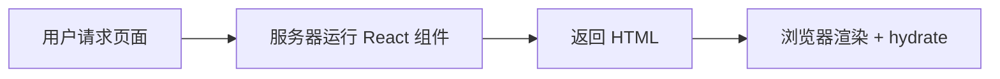
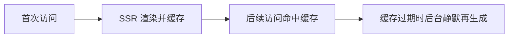
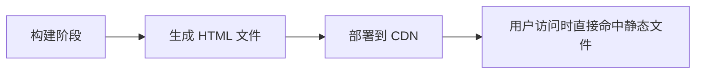
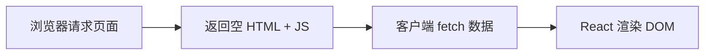

# 概述

[Next.js ↪](https://nextjs.org/) 是一个基于 React 的全栈框架，用于快速构建高性能的服务器端渲染（SSR）和静态生成（SSG）网页应用。

本文主要记录 Next.js 的学习路程，便于日后回溯，非官方指南，中文指南请参考 [这里 ↪](https://nextjs.net.cn/)

相关环境：

- Node.js：v25.1.0
- pnpm：v10.20.0
- Next.js：v16
- 路由模式：App Router

## SSR / ISR / SSG / CSR

这四个渲染模式是理解 Next.js、现代前端架构和性能优化 的核心概念。

### SSR

Server-Side Rendering（服务器端渲染）

**原理：**

- 每次用户访问页面时，服务器都会执行 React 代码，然后生成 HTML 返回浏览器。
- 浏览器接收后再进行水合（hydrate）→ 变成交互页面。



**特点：**

- 每次请求都是真实渲染 → 数据最新。
- 首屏快，SEO 友好，但服务器压力较大。

```tsx
export const dynamic = "force-dynamic"; // 强制 SSR

export default async function Page() {
  const res = await fetch("https://api.example.com/data", { cache: "no-store" });
  const data = await res.json();
  return <div>{data.title}</div>;
}
```

**适用场景：**需要实时数据的页面（如用户中心、订单详情、新闻实时榜单）。

### ISR

Incremental Static Regeneration（增量静态再生成）

**原理：**

- 首次访问时生成静态 HTML
- 缓存到 CDN
- 后续请求命中缓存
- 一段时间后缓存过期，下一次请求触发再生成



**特点：**

- 首屏性能接近静态
- 数据可定期更新
- 对服务器压力低

```tsx
export const revalidate = 60; // 每 60 秒再生成一次页面

export default async function Page() {
  const res = await fetch("https://api.example.com/posts");
  const posts = await res.json();
  return <PostList posts={posts} />;
}
```

**适用场景**：内容经常变但不需实时（如首页、产品列表、博客文章页）。

### SSG

Static Site Generation（静态生成）

**原理：**

- 在 **构建时** 就生成所有页面的 HTML
- 部署后直接走 CDN 静态文件



**特点：**访问极快，几乎无服务器负担，但内容固定（除非重新部署）。

```tsx
export const dynamic = "force-static"; // 强制 SSG

export async function generateStaticParams() {
  const posts = await fetch("https://api.example.com/posts").then((r) => r.json());
  return posts.map((p) => ({ slug: p.slug }));
}

export default function Post({ params }) {
  // 所有静态页面在构建时生成
}
```

**适用场景**：几乎不变化的页面（如博客、产品文档、Landing Page）

### CSR

Client-Side Rendering（客户端渲染）

**原理：**

- 首屏返回一个空的 HTML + JS；
- 浏览器加载 JS 后，自己 fetch 数据并渲染页面。



**特点：**完全在浏览器端渲染，不适合 SEO，但最灵活，适合复杂交互。

```tsx
"use client";
import { useEffect, useState } from "react";

export default function Dashboard() {
  const [data, setData] = useState(null);

  useEffect(() => {
    fetch("/api/user").then(res => res.json()).then(setData);
  }, []);

  return <div>{data ? data.name : "Loading..."}</div>;
}
```

**适用场景**：后台管理系统、可视化界面、登录后交互页面、控制台、表单页面等。

总结一句话：

1、**SSR**：实时渲染，适合频繁变动内容

2、**ISR**：准实时渲染，兼顾性能与动态

3、**SSG**：构建时生成，性能最强但静态

4、**CSR**：客户端渲染，适合登录后复杂交互

# 创建项目

@See https://nextjs.org/docs/app/getting-started/installation

```shell
$ pnpm create next-app@latest nextjs-template [--yes]
✔ Would you like to use the recommended Next.js defaults? › No, customize settings
✔ Would you like to use TypeScript? … No / 【Yes】
✔ Which linter would you like to use? › Biome
✔ Would you like to use React Compiler? … No / 【Yes】
✔ Would you like to use Tailwind CSS? … No / 【Yes】
✔ Would you like your code inside a `src/` directory? … No / 【Yes】
✔ Would you like to use App Router? (recommended) … No / 【Yes】
✔ Would you like to use Turbopack? (recommended) … No / 【Yes】
✔ Would you like to customize the import alias (`@/*` by default)? … No / 【Yes】
✔ What import alias would you like configured? … @/*
```

> **提示**：`--yes` 会跳过提示，使用已保存的偏好或默认设置。

# 目录结构

@See https://nextjs.org/docs/app/getting-started/project-structure

```
$ tree -I 'node_modules' -L 3
.
├── biome.json
├── commitlint.config.js
├── env/
├── env.d.ts
├── next-env.d.ts
├── next.config.ts
├── package.json
├── pnpm-lock.yaml
├── postcss.config.mjs
├── public                     # 静态文件，如图片、字体、图标等
│   ├── fonts
│   ├── images
│   ├── styles
│   │   ├── overrides
│   │   ├── skins
│   │   └── themes
│   └── sw.js
├── README.md
├── scripts
│   ├── build-styles
│   ├── convert-css-vars
│   └── excel2json
├── src
│   ├── api
│   │   ├── apiConfig
│   │   └── apiServer
│   ├── app                    # 使用 App Router 的页面结构 (Next.js 13+)
│   │   ├── [lang]
│   │   │   ├── (app)          # 需要主题布局的路由组
│   │   │   │   ├── (home)     # 首页
│   │   │   │   └── others...  # 其他页面
│   │   │   ├── (modals)       # 路由弹框
│   │   │   ├── (standalone)   # 无需主题布局的路由组
│   │   │   │   └── xxx  
│   │   │   └── not-found.tsx  # 多语言路由组 404
│   │   ├── favicon.ico
│   │   ├── layout.tsx         # 应用根布局
│   │   ├── page.tsx
│   │   └── not-found.tsx      # 全局404
│   ├── components             # 组件
│   │   ├── features           # 业务组件
│   │   ├── layout             # 布局组件
│   │   └── ui                 # 基础组件
│   ├── configs                # 品牌/项目配置项（非必须，可使用环境变量）
│   │   └── brands
│   ├── constants              # 常量定义
│   ├── hooks                  # 自定义钩子
│   ├── i18n                   # 国际化i18n next-intl
│   │   ├── locales
│   │   ├── navigation.ts
│   │   ├── request.ts
│   │   └── routing.ts
│   ├── libs                   # 工具函数
│   │   ├── brand.ts
│   │   └── class-helpers.ts
│   ├── providers
│   │   └── brand.provider.tsx # 全局 Provider（如 Context API 或 Redux Provider）
│   ├── proxy.ts
│   ├── stores
│   │   └── globalStore.ts
│   └── types
└── tsconfig.json
```

# 环境变量

在多品牌、多环境（如开发、预发布、生产）项目中，合理地组织和加载环境变量，可以让构建与部署更加灵活、稳定。

假设现在有两个品牌：`afun` `bfun`

1、创建相关文件

```shell
$ mkdir -p env && touch env/.env.{afun,bfun}.{dev,stage,prod} env.d.ts
```

目录结构如下：

```shell
$ tree env -a
env.d.ts
env
├── .env.afun.dev
├── .env.afun.prod
├── .env.afun.stage
├── .env.bfun.dev
├── .env.bfun.prod
└── .env.bfun.stage
```

2、类型声明 `env.d.ts`（根目录）

```ts
// -- 客户端环境变量
interface ClientEnv {
  NEXT_PUBLIC_API_BASE_URL: string;
  NEXT_PUBLIC_BRAND_NAME: string;
}

// -- 服务端环境变量
interface ServerEnv {
  APP_ENV: "dev" | "stage" | "prod";
}

declare global {
  namespace NodeJS {
    interface ProcessEnv extends ClientEnv, ServerEnv {
      // ...
    }
  }
}

export {};
```

> 注意：
>
> - 所有以 NEXT_PUBLIC_ 开头的变量会被 Next.js 暴露到浏览器端。
> - 其他变量（例如 APP_ENV）仅在服务端可用。

3、示例环境变量文件，以 afun 品牌的开发环境为例：

```ini
# .env.afun.dev
APP_ENV=dev
NEXT_PUBLIC_API_BASE_URL=https://dev.afun.example.com
NEXT_PUBLIC_BRAND_NAME=afun
```

> 以 `.env.afun.dev` 为例

4、安装依赖，我们使用 `dotenv` `dotenv-cli` 来加载 .env 文件中的环境变量：

```shell
$ pnpm add dotenv dotenv-cli -D
```

5、配置 `package.json`

```json
{
  "scripts": {
    "dev:afun": "dotenv -e env/.env.afun.dev -- next dev --turbopack",
    "dev:bfun": "dotenv -e env/.env.bfun.dev -- next dev --turbopack",

    "build:afun-stage": "dotenv -e env/.env.afun.stage -- next build --turbopack",
    "build:bfun-stage": "dotenv -e env/.env.bfun.stage -- next build --turbopack",

    "build:afun-prod": "dotenv -e env/.env.afun.prod -- next build --turbopack",
    "build:bfun-prod": "dotenv -e env/.env.bfun.prod -- next build --turbopack"
  }
}
```

以上指令可以通过变量参数简化：

```json
{
  "scripts": {
    "dev": "dotenv -e env/.env.${app-afun}.dev -- next dev --turbopack",
    "build": "dotenv -e env/.env.$app.$env -- next build --turbopack",
  }
}
```

执行指令：

```shell
# 开发环境
$ app=xxx pnpm dev
# 预发 & 生产环境
$ app=xxx env=xxx pnpm build

# eg.1 启动 afun 项目，执行指令：
$ app=afun pnpm dev

# eg.2 构建 afun 生产环境，执行指令：
$ app=afun env=prod pnpm build
```

> 💡 提示：默认为 `afun`，即执行：`pnpm dev`

6、访问环境变量

```tsx
process.env.NEXT_PUBLIC_API_BASE_URL  // 浏览器端和服务端均可用
process.env.APP_ENV                   // 仅服务端可用
```

# 开发规范

## 代码规范检查与修复 + 代码风格

选择 [Biome ↪](https://biomejs.dev/zh-cn/)

在初始化项目时，我们已经选择了基于 Biome 来实现代码规范检查与修复和代码风格的控制，接下来我们简单配置。

1、安装 [Biome VS Code 扩展 ↪](https://marketplace.visualstudio.com/items?itemName=biomejs.biome)，快捷键 <kbd>Cmd</kbd> + <kbd>Shift</kbd> + <kbd>X</kbd>

2、快捷键 <kbd>Cmd</kbd> + <kbd>,</kbd> 搜索 Editor: Default Formatter，选择 Biome 作为默认格式化程序

3、搜索 Editor: Format On Save，☑️ 保存时设置文件格式

4、在 package.json 文件中加入如下快捷指令

```
"lint": "biome check .",
"lint:fix": "biome check --write .",
```

5、统一风格，项目内配置 `.vscode` 目录

```shell
$ mkdir -p .vscode && touch .vscode/{extensions,settings}.json
$ tree .vscode -a
.vscode
├── extensions.json
└── settings.json
```

> `settings.json`

```json
{
	"editor.defaultFormatter": "biomejs.biome",
	"editor.formatOnSave": true,
	"editor.insertSpaces": true,
	"editor.tabSize": 2,
	"editor.codeActionsOnSave": {
		"source.fixAll.biome": "explicit",
		"source.organizeImports.biome": "explicit"
	}
}
```

> `extensions.json`

```tsx
{
  "recommendations": ["biomejs.biome"]
}
```

## Commit 规范检查

推荐：Conventional Commits + Husky + lint-staged + Commitlint

这套组合可以在提交前自动检查代码规范、校验 commit 信息格式，并提供交互式的提交体验。

1、安装依赖

```shell
$ pnpm add -D husky lint-staged @commitlint/{config-conventional,cli}
```

2、在 `package.json` 中配置 `lint-staged`

```json
"lint-staged": {
  "*.{js,jsx,ts,tsx}": [
    "pnpm lint"
  ]
},
```

当你执行 git commit 时，lint-staged 会自动运行 pnpm lint 来检查暂存区的文件，防止格式或语法问题被提交。

3、初始化 husky

```shell
$ pnpm husky init
```

这会自动创建 .husky/ 目录和一个默认的 pre-commit 钩子。

4、配置 pre-commit 钩子，编辑 .husky/pre-commit 文件：

```bash
#!/usr/bin/env sh
. "$(dirname -- "$0")/_/husky.sh"

# 在提交前执行代码格式化与检查
pnpm lint-staged
```

提交前会自动运行 lint-staged，确保提交的代码风格、语法正确。

5、配置 commit-msg 钩子，创建 .husky/commit-msg 文件：

```bash
#!/usr/bin/env sh
. "$(dirname -- "$0")/_/husky.sh"

pnpm commitlint --edit "$1"
```

这个钩子会在每次提交时校验你的提交信息是否符合 Conventional Commits 规范。

6、创建 commitlint 配置，在项目根目录新建 `commitlint.config.js`：

```js
export default {
  extends: ["@commitlint/config-conventional"],
  rules: {
    "type-enum": [
      2,
      "always",
      [
        "feat",      // ✨ 新功能
        "fix",       // 🐛 修复 bug
        "docs",      // 📝 文档更新
        "style",     // 💅 代码格式（不影响逻辑）
        "refactor",  // ♻️ 重构（非新增功能、非修复）
        "perf",      // ⚡️ 性能优化
        "test",      // ✅ 测试相关修改
        "build",     // 🏗️ 构建系统或依赖更新
        "ci",        // 🤖 CI/CD 配置变更
        "chore",     // 🔧 杂项任务
        "revert"     // ⏪ 回滚提交
      ]
    ],
    "subject-case": [0]
  }
}
```

现在，当你执行 git commit 时，Husky 会自动触发以下两个钩子：

| **阶段** | **钩子名** | **执行内容**                | **目的**                   |
| -------- | ---------- | --------------------------- | -------------------------- |
| 提交前   | pre-commit | pnpm lint-staged            | 检查暂存区代码是否符合规范 |
| 提交时   | commit-msg | pnpm commitlint --edit "$1" | 校验提交信息格式           |

👉 这样，你的项目会在提交时自动检查代码质量和提交信息规范，确保仓库记录干净、统一、可读。

7、引导式提交（推荐）

为了让团队成员更方便地书写规范化的 commit message，我们可以使用 **Commitizen** 提供交互式提交体验：

```shell
$ pnpm add -D commitizen cz-conventional-changelog
```

在 package.json 中添加配置：

```json
{
  "config": {
    "commitizen": {
      "path": "cz-conventional-changelog"
    }
  },
  "scripts": {
    "commit": "cz"
  }
}
```

然后执行命令：

```shell
$ pnpm commit
```

系统会弹出一个交互式命令行界面，引导你选择提交类型、填写变更说明。

# 样式

@See https://nextjs.org/docs/app/getting-started/css

## Tailwind CSS

选择： [tailwindcss  ↪](https://tailwindcss.com/)

创建项目时，已 ☑️ 启用tailwindcss

tailwindcss 工具，新建 `@/libs/class-helpers.ts`

```shell
$ pnpm add class-variance-authority tailwind-merge
```

```ts
/**
 * TailwindCSS ClassName 工具函数
 *
 * 用途：
 * - cn: 拼接类名并自动合并 Tailwind 冲突类，适合组件中使用。
 * - clsx: 条件拼接类名，不合并冲突，适合快速临时类名拼接。
 *
 * 使用：
 * import { cn, clsx } from "@/lib/class-helpers";
 *
 * 安装依赖：
 * pnpm add class-variance-authority tailwind-merge
 *
 * 参考：
 * - https://github.com/joe-bell/cva
 * - https://github.com/dcastil/tailwind-merge
 */

import { type CxOptions, cx } from "class-variance-authority";
import { twMerge } from "tailwind-merge";

/** 拼接类名并自动合并 Tailwind 冲突类 */
export function cn(...inputs: CxOptions) {
  return twMerge(cx(inputs));
}

/** 条件拼接类名，不处理冲突 */
export function clsx(...inputs: CxOptions) {
  return cx(inputs);
}
```

## 类名排序

tailwindcss 保存时设置类名排序（Biome 目前不支持tailwindcss类名排序，因此需要混合使用 Prettier）

1、安装依赖

```shell
$ pnpm add -D prettier prettier-plugin-tailwindcss
```

2、根目录新建 `.prettierrc` 文件

```json
{
  "plugins": ["prettier-plugin-tailwindcss"],
  "singleQuote": true,
  "semi": true,
  "trailingComma": "all",
  "printWidth": 100,
  "bracketSpacing": true,
  "jsxSingleQuote": false,
  "arrowParens": "always",
  "endOfLine": "lf"
}
```

3、`.vscode/settings.json`（Biome + Prettier 联动）

```json
{
  "editor.defaultFormatter": "biomejs.biome",
  "editor.formatOnSave": true,
  "editor.insertSpaces": true,
  "editor.tabSize": 2,

  "editor.codeActionsOnSave": {
    "source.fixAll.biome": "explicit",
    "source.organizeImports.biome": "explicit"
  },

  // TSX 文件使用 Prettier（Tailwind 类名排序）
  "[typescriptreact]": {
    "editor.defaultFormatter": "esbenp.prettier-vscode"
  }
}
```

# 获取数据

@See https://nextjs.org/docs/app/getting-started/fetching-data

# 状态管理

1、安装依赖

```shell
$ pnpm add zustand immer
```

2、定义 store

```ts
// src/stores/globalStore.ts
import { create } from "zustand";
import { immer } from "zustand/middleware/immer";

type GlobalStateProps = {
  count: number;
  increment: () => void;
  decrement: () => void;
};

export const useGlobalStore = create<GlobalStateProps>()(
  immer((set) => ({
    count: 0,
    increment: () =>
      set((state) => {
        state.count += 1;
      }),
    decrement: () =>
      set((state) => {
        state.count -= 1;
      }),
  })),
);
```

3、使用示例

```tsx
// src/app/[lang]/_components/Counter.tsx
"use client";
import { useGlobalStore } from "@/stores/globalStore";

export default function Counter() {
  const { count, increment, decrement } = useGlobalStore((state) => state);
  return (
    <div>
      <div>计数器：{count}</div>
      <button type="button" onClick={increment}>+1</button>
      <button type="button" onClick={decrement}>-1</button>
    </div>
  )
}

```

# 国际化 next-intl


## 概述

@See https://nextjs.org/docs/app/guides/internationalization

@See https://github.com/amannn/next-intl/tree/main/examples/example-app-router

[next-intl ↪](https://next-intl.dev/) 使用 **ICU Message Format** 语法，与 React 组件天然兼容。 支持变量替换、复数、选择分支、HTML 片段等多场景。

## 准备

### 目录结构

```
src
├── next.config.ts                  
├── app
│   ├── [lang]
│   │   ├── layout.tsx
│   │   └── page.tsx
│   ├── components
│   │   ├── features     
│   │   │   ├── ClientComp.tsx
│   │   │   └── ServerComp.tsx
│   │   ├── layout
│   │   │   └── LanguageSwitcher.tsx
│   │   └── ui
├── i18n
│   ├── locales           # 通过脚本输出 —— pnpm i18n:json
│   │   ├── en-US.json
│   │   ├── es.json
│   │   ├── pt.json
│   │   └── zh-CN.json
│   ├── navigation.ts
│   ├── request.ts
│   └── routing.ts		 
└── proxy.ts	
```

### 安装依赖

```shell
$ pnpm add next-intl
```

### 翻译准备

假设支持 `zh-CN` `en-US` `pt` `es`，传统模式下翻译经由专人维护一个 Excel 表，大致如下：

| key             | zh-CN                                  | en-US                                                       | pt                                                 | es                                                    |
| --------------- | -------------------------------------- | ----------------------------------------------------------- | -------------------------------------------------- | ----------------------------------------------------- |
| title           | i18n 学习指南                          | i18n Study Guide                                            | Guia de Estudo de i18n                             | Guía de Estudio de i18n                               |
| profile.tips    | 会员已到期，请充值                     | Membership has expired, please renew.                       | A associação expirou, por favor renove.            | La membresía ha expirado, por favor renueve.          |
| profile.reward1 | 恭喜您，获得 {point} 个积分            | Congratulations! You’ve earned {point} points.              | Parabéns! Você ganhou {point} pontos.              | ¡Felicidades! Has ganado {point} puntos.              |
| profile.reward2 | 恭喜您，获得 \<tag>{point}\</tag> 积分 | Congratulations! You’ve earned \<tag>{point}\</tag> points. | Parabéns! Você ganhou \<tag>{point}\</tag> pontos. | ¡Felicidades! Has ganado \<tag>{point}\</tag> puntos. |

> 💡 翻译人员可以使用[Crowdin](https://crowdin.com/teams/engineering)等本地化管理解决方案协作处理消息。

此时，可以通过脚本工具将 Excel 转成 json，这里给大家简单分享一个可以满足基本需求的脚本。

```shell
$ tree scripts
scripts
└── excel2json
    ├── index.ts          # 执行文件
    └── translations.xlsx # 翻译源文件
```

> `index.ts`

```ts
/**
 * src/scripts/excel2json/index.ts
 * Excel → JSON 翻译导出脚本
 * 安装依赖：pnpm add -D xlsx fs path tsx
 */

import fs from "node:fs";
import path from "node:path";
import XLSX from "xlsx";

// === 1. 可配置变量 ===
const EXCEL_FILE_NAME = "translations.xlsx";
const SHEET_NAME = "Sheet1";
const ROOT = path.resolve(__dirname, "../../");
const INPUT_DIR = path.join(ROOT, "/scripts/excel2json");
const OUTPUT_DIR = path.join(ROOT, "/src/i18n/locales");

// === 2. 类型定义 ===
interface ExcelRow {
  /** 翻译 key */
  key?: string;
  /** 备注（可选） */
  remark?: string;
  /** 语言列 */
  [lang: string]: string | undefined;
}

type NestedObject = {
  [key: string]: string | NestedObject;
};

// === 3. 读取 Excel 文件 ===
const excelPath = path.join(INPUT_DIR, EXCEL_FILE_NAME);
console.log(`📂 读取 Excel 文件: ${excelPath}`);

const workbook = XLSX.readFile(excelPath);
const sheet = SHEET_NAME
  ? workbook.Sheets[SHEET_NAME]
  : workbook.Sheets[workbook.SheetNames[0]];

if (!sheet) throw new Error(`❌ 找不到 Excel sheet: ${SHEET_NAME}`);
console.log(`📄 使用 Sheet: ${SHEET_NAME || workbook.SheetNames[0]}`);

const rawData: ExcelRow[] = XLSX.utils.sheet_to_json(sheet);
console.log(`🔑 Excel 共读取 ${rawData.length} 条记录`);

// === 4. 获取语言列 ===
const header: string[] = Object.keys(rawData[0] || {}).filter(
  (key) => key !== "key" && key !== "remark",
);
console.log(`🌐 发现语言列: ${header.join(", ")}`);

// === 5. 递归写入对象属性 ===
function setNested(obj: NestedObject, keyPath: string, value: string) {
  const keys = keyPath.split(".");
  let current: NestedObject = obj;
  keys.forEach((k, i) => {
    if (i === keys.length - 1) {
      current[k] = value;
    } else {
      current[k] = (current[k] as NestedObject) || {};
      current = current[k] as NestedObject;
    }
  });
}

// === 6. 初始化结果对象和计数器 ===
const result: Record<string, NestedObject> = {};
const langCounts: Record<string, number> = {};
header.forEach((lang) => {
  result[lang] = {};
  langCounts[lang] = 0;
});

// === 7. 处理每一行数据 ===
rawData.forEach((row) => {
  const key = row.key?.toString().trim();
  if (!key) return; // 没有 key 整行跳过

  header.forEach((lang) => {
    let value = row[lang];
    if (value !== undefined && value !== null && String(value).trim() !== "") {
      value = String(value).trim();
      setNested(result[lang], key, value);
      langCounts[lang] += 1; // 只统计有值的翻译
    }
  });
});

// === 8. 输出 JSON 文件并显示提示 ===
if (!fs.existsSync(OUTPUT_DIR)) fs.mkdirSync(OUTPUT_DIR, { recursive: true });

header.forEach((lang) => {
  const filePath = path.join(OUTPUT_DIR, `${lang}.json`);
  fs.writeFileSync(filePath, JSON.stringify(result[lang], null, 2), "utf8");
  console.log(
    `✅ [${lang}] 文件生成: ${filePath}，共 ${langCounts[lang]} 条有效翻译`,
  );
});

console.log(`🎉 转换完成！共生成 ${header.length} 个语言文件`);
console.log(`📂 输出目录: ${OUTPUT_DIR}`);

```

添加 scripts 命令：

```json
{
	"i18n:json": "tsx scripts/excel2json/index.ts"
}
```

执行脚本命令：`pnnpm i18n:json` 即可生成对应的语言 json 文件 — `src/i18n/locales/...`

## 实现

1、在 `next.config.ts` 中集成插件

```ts
import type { NextConfig } from "next";
import createNextIntlPlugin from "next-intl/plugin";

const nextConfig: NextConfig = {
  /* config options here */
  reactCompiler: true,
};

const withNextIntl = createNextIntlPlugin();
export default withNextIntl(nextConfig);
```

2、路由配置

@See https://next-intl.dev/docs/routing/configuration

> `i18n/routing.ts`

```ts
/**
 * i18n 路由配置
 * @see https://next-intl.dev/docs/routing/configuration
 */

import { defineRouting } from "next-intl/routing";

// -- 定义支持的语言环境和默认语言环境
export const locales = ["zh-CN", "en-US", "pt", "es"] as const;
export type Locale = (typeof locales)[number];

export const defaultLocale = "zh-CN";

// -- 定义路由配置
export const routing = defineRouting({
  locales,
  defaultLocale,
  localePrefix: "as-needed",
});
```

3、设置代理

@See https://next-intl.dev/docs/routing/middleware

> `src/proxy.ts`

```ts
import createMiddleware from "next-intl/middleware";
import { routing } from "./i18n/routing";

export default createMiddleware(routing);

export const config = {
  // Match all pathnames except for
  // - … if they start with `/api`, `/trpc`, `/_next` or `/_vercel`
  // - … the ones containing a dot (e.g. `favicon.ico`)
  matcher: "/((?!api|trpc|_next|_vercel|.*\\..*).*)",
};
```

4、设置导航 API

@See https://next-intl.dev/docs/routing/navigation

> `i18n/navigation.ts`

```ts
import { createNavigation } from "next-intl/navigation";
import { routing } from "./routing";

// Lightweight wrappers around Next.js' navigation
// APIs that consider the routing configuration
export const { Link, redirect, usePathname, useRouter, getPathname } = createNavigation(routing);
```

5、请求配置

> `i18n/request.ts`

```ts
import { hasLocale } from "next-intl";
import { getRequestConfig } from "next-intl/server";
import { routing } from "./routing";

export default getRequestConfig(async ({ requestLocale }) => {
  // Typically corresponds to the `[locale]` segment
  const requested = await requestLocale;
  const locale = hasLocale(routing.locales, requested)
    ? requested
    : routing.defaultLocale;

  return {
    locale,
    messages: (await import(`./locales/${locale}.json`)).default,
  };
});
```

6、语言路由布局，把所有现有的布局和页面移到 `[lang]` 部分中：

```tsx
src
└── app
    └── [lang]
        ├── layout.tsx
        ├── page.tsx
        └── ...
```

> `src/[lang]/layout.tsx`

```tsx
import "@/app/globals.css";
import { notFound } from "next/navigation";
import { hasLocale, NextIntlClientProvider } from "next-intl";
import { getMessages, setRequestLocale } from "next-intl/server";
import { routing } from "@/i18n/routing";

type Props = {
  children: React.ReactNode;
  params: Promise<{ lang: string }>;
};


export default async function LocaleLayout({ children, params }: Props) {
  const { lang } = await params;

  // Ensure that the incoming `locale` is valid
  if (!hasLocale(routing.locales, lang)) {
    notFound();
  }

  // Enable static rendering
  setRequestLocale(lang);

  // Providing all messages to the client
  // side is the easiest way to get started
  const messages = await getMessages();

  return (
    <html lang={lang}>
      <body>
        <NextIntlClientProvider locale={lang} messages={messages}>
          {children}
        </NextIntlClientProvider>
      </body>
    </html>
  );
}
```

7、使用翻译

>  `app/[lang]/page.tsx` 

```tsx
import ClientComp from "@/components/features/ClientComp";
import LanguageSwitcher from "@/components/features/LanguageSwitcher";
import ServerComp from "@/components/features/ServerComp";

export default function Page() {
  return (
    <div className="p-4 flex flex-col items-center gap-4">
    <LanguageSwitcher />
     <div className="flex gap-4 items-start">
       <ClientComp />
       <ServerComp />
     </div>
    </div>
  );
}
```

> 客户端组件

```tsx
// src/components/features/ClientComp.tsx
"use client";
import { useTranslations } from "next-intl";

export default function ClientComp() {
  const t = useTranslations();
  const point = 6000;
  return (
    <div className="w-full flex flex-col items-center gap-4">
      <div>客户端组件</div>
      <div>{process.env.NEXT_PUBLIC_API_BASE_URL}</div>
      <div className="bg-gray-200 w-full p-4 space-y-2 text-black">
        {/* 1. 没有变量 */}
        <div>{t("title")}</div>
        <div>{t("profile.tips")}</div>

        {/* 2. 存在变量（插值） */}
        <div>{t("profile.reward1", { point })}</div>

        {/* 3. 自定义渲染 */}
        <div>
          {t.rich("profile.reward2", {
            tag: (children) => (
              <span className="text-red-500 font-bold">{children}</span>
            ),
            point,
          })}
        </div>
      </div>
    </div>
  );
}

```

> 服务端组件

```tsx
// src/components/features/ServerComp.tsx
import { getTranslations } from "next-intl/server";

export default async function ServerComp() {
  const t = await getTranslations();
  const point = 6000;
  return (
    <div className="w-full flex flex-col items-center gap-4">
      <div>服务端组件</div>
      <div>{process.env.NEXT_PUBLIC_API_BASE_URL}</div>
      <div className="bg-gray-200 w-full p-4 space-y-2 text-black">
        {/* 1. 没有变量 */}
        <div>{t("title")}</div>
        <div>{t("profile.tips")}</div>

        {/* 2. 存在变量（插值） */}
        <div>{t("profile.reward1", { point })}</div>

        {/* 3. 自定义渲染 */}
        <div>
          {t.rich("profile.reward2", {
            tag: (children) => (
              <span className="text-red-500 font-bold">{children}</span>
            ),
            point,
          })}
        </div>
      </div>
    </div>
  );
}
```

8、切换语言

```tsx
// src/components/features/LanguageSwitcher.tsx
"use client";

import { usePathname, useRouter } from "next/navigation";
import { type Locale, routing } from "@/i18n/routing";
import { clsx } from "@/lib/class-helpers";

/**
 * LanguageSwitcher 组件
 *
 * 功能：
 * - 显示可用语言列表，每个按钮带国旗
 * - 当前选中语言高亮
 * - 点击按钮切换语言，使用 router.replace 替换当前 URL，不增加历史记录
 *
 * 数据依赖：
 * - routing.locales: 项目支持的语言列表
 * - routing.defaultLocale: 默认语言
 *
 * 用法：
 * <LanguageSwitcher />
 *
 * 备注：
 * - 使用了 clsx 工具函数来处理 Tailwind 类名动态拼接
 */

// 语言列表直接包含国旗
const langs: { code: Locale; label: string }[] = [
  { code: "zh-CN", label: "🇨🇳 Chinese" },
  { code: "en-US", label: "🇺🇸 English" },
  { code: "pt", label: "🇧🇷 Português" },
  { code: "es", label: "🇪🇸 Español" },
];

export default function LanguageSwitcher() {
  const router = useRouter();
  const pathname = usePathname();

  // 当前语言前缀
  const currentLang =
    routing.locales.find((locale) => pathname?.startsWith(`/${locale}`)) ??
    routing.defaultLocale;

  // 切换语言
  const onSwitchLang = (lang: { code: Locale; label: string }) => {
    const segments = pathname.split("/").filter(Boolean) as Locale[];

    // 如果 URL 首段是已知语言，直接替换；否则在前面添加
    if (routing.locales.includes(segments[0])) {
      segments[0] = lang.code;
    } else {
      segments.unshift(lang.code);
    }

    // 替换当前页面，不增加浏览历史
    router.replace(`/${segments.join("/")}`);
  };

  return (
    <div className="flex items-center gap-2">
      {langs.map((lang) => {
        const isActive = lang.code === currentLang;

        return (
          <button
            key={lang.code}
            type="button"
            onClick={() => onSwitchLang(lang)}
            className={clsx(
              "px-3 py-1.5 border rounded text-sm transition-colors cursor-pointer",
              isActive
                ? "bg-blue-600 text-white border-blue-600"
                : "bg-white text-gray-700 border-gray-300 hover:bg-gray-100",
            )}
          >
            {lang.label}
          </button>
        );
      })}
    </div>
  );
}
```

## 扩展

关于多语言下处理 404 和 Error 的坑，请参考 [这里 ↪]( https://github.com/amannn/next-intl/discussions/329)

# PWA

@See https://nextjs.org/docs/app/guides/progressive-web-apps

PWA（Progressive Web App，渐进式网页应用）是一种融合了网页与原生应用优点的现代 Web 技术，通过使用 Service Worker、Web App Manifest 等特性，使网站能够离线访问、支持推送通知、具备安装到桌面的能力，并在性能、体验和交互上接近原生 App，同时保持跨平台和易于更新的优势。

## 创建 Web 应用程序清单

Next.js 使用 App Router 内置支持创建 [Web 应用程序清单 ↪](https://developer.mozilla.org/zh-CN/docs/Web/Progressive_web_apps/Manifest)。

> `app/manifest.ts`

```ts
import type { MetadataRoute } from "next";

export default function manifest(): MetadataRoute.Manifest {
  return {
    name: "Next.js App",
    short_name: "Next.js App",
    description: "Next.js App",
    start_url: "/",
    display: "standalone",
    background_color: "#fff",
    theme_color: "#fff",
    icons: [
      {
        src: "/favicon.ico",
        sizes: "any",
        type: "image/x-icon",
      },
    ],
  };
}
```

> **提示**：你可以通过 [网站图标生成器 ↪](https://realfavicongenerator.net/) 生产对应的图标。

## 新建 public/sw.js

```ts
self.addEventListener("install", () => {
  // 不缓存内容，只为让浏览器识别为 PWA
  self.skipWaiting();
});
```

## 在 app/layout.tsx 中加入 manifest 引用

💡 **Tip**：要测试 PWA 是否生效：

1. 运行生产环境：

   pnpm build:qa

   pnpm start:qa

1. 浏览器访问 H5 页面，打开 **DevTools → Application → Manifest**
2. 检查 **“Add to Home Screen”** 提示和图标
3. 查看 **Service Worker** 是否注册

# 多主题多皮肤

参考阅读：

# 集成 shadcn-ui

参考 [这里 ↪](https://ui.shadcn.com/docs/installation/next/)

> 💣 **注意**：初始化时会在 @/lib/utils.ts 创建工具函数文件。如果本地已有同名文件，建议提前重命名（如 helpers.ts），以免被覆盖。

## 初始化项目配置

执行：

```shell
$ pnpm dlx shadcn@latest init
```

主要操作：

1. 检测项目环境 ✅
2. 生成 Base Color 配置 ✅
3. 创建 components.json ✅
4. 更新 globals.css 的 CSS 变量 ✅
5. 安装依赖 ✅
6. 创建基础工具函数文件 utils.ts ✅

> 💡 提示：想更改组件生成路径，可在 components.json 的 aliases 中修改。

## 安装组件

例如安装 [Dialog ↪](https://ui.shadcn.com/docs/components/dialog)：

```shell
$ pnpm dlx shadcn@latest add dialog
```

默认会生成：

```
src/components/ui/dialog.tsx
```

你可以根据项目习惯重命名或调整结构：

```
src/components/ui/Dialog.tsx
```

或

```
src/components/ui/Dialog/index.tsx
```

> 建议：为了统一导入路径，可在 index.tsx 中做一次 re-export，例如：

```ts
export { Dialog } from './DialogComponentFile';
```

